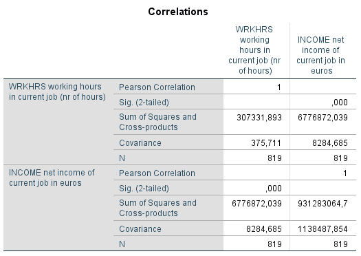

```{r, echo = FALSE, results = "hide"}
include_supplement("1602856060527.png", recursive = TRUE)
include_supplement("1602856133971.png", recursive = TRUE)
```

Question
========
  
 
  

  
In the above covariance/correlation matrix, the correlation between labor hours (WRKHRS) and income (INCOME) has been omitted. What is the correlation? *Give a number in two decimal places, nothing else.*


Solution
========

Meta-information
================
exname: vufsw-pearson-1349-en
extype: string
exsolution: 0.40
exsection: inferential statistics/parametric techniques/correlations/pearson
exextra[ID]: 89d2e
exextra[Type]: performing analysis
exextra[Program]: calculator
exextra[Language]: English
exextra[Level]: statistical literacy

