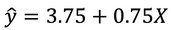

```{r, echo = FALSE, results = "hide"}
include_supplement("1639492084730.png", recursive = TRUE)
```

Question
========
A researcher conducted a regression analysis to predict a person's interest in politics (Y) to predict <span class="tvcss_2 tvcss_3 tvcss_4 tvcss_5 tvcss_6 tvcss_7">based on how often a person reads news articles per week (X). </span>Political interest was measured using a scale ranging from 1 ('not at all interested') to 10 (<span class="tvcss_2 tvcss_3 tvcss_4 tvcss_5 tvcss_6 tvcss_7">'</span>very interested'). The formula accompanying the regression line is shown below: What score of political interest can we use this to predict for someone who reads news articles once a week?   


Answerlist
----------
* 3.75
* 4.50
* 1.00
* 1.75

Solution
========

Answerlist
----------
* False
* True
* False
* False

Meta-information
================
exname: vufsw-prediction-0067-en
extype: schoice
exsolution: 0100
exshuffle: TRUE
exsection: inferential statistics/regression/prediction
exextra[ID]: f4675
exextra[Type]: calculation
exextra[Program]: calculator
exextra[Language]: English
exextra[Level]: statistical literacy

