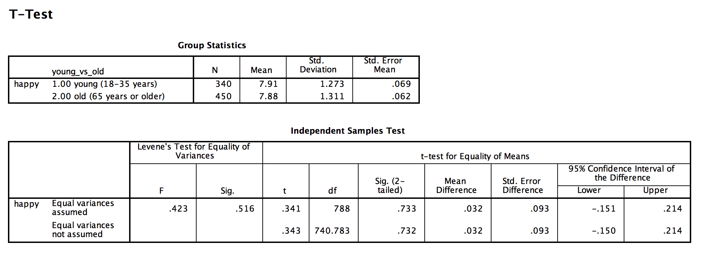

```{r, echo = FALSE, results = "hide"}
include_supplement("Screen__Shot__2019-03-24__at__14.56.10.png", recursive = TRUE)
```

Question
========
A random sample of 1919 respondents in the Netherlands (source: *European Social Survey*, 2016) were asked the following question posed, "All things considered, how happy would you say you are?", where the response options ranged between "very unhappy" (0) and "very happy (10).  
  
We conducted a t-test for two means (independent t-test) conducted to test whether there was a significant difference between young people (group 1: 18 to 30 years old) and older people (group 2: 65 years old or older). The results are shown in the output below.  
  
The P-value in this two-sided test turns out to be 0.733. What can we conclude from this?   
  


Answerlist
----------
* There is a 73% chance that we observe this difference between young and old people (or an even **greater **difference), if the **zero** hypothesis is TRUE.
* The probability is 73% that we observe this difference between young and old people (or an even **greater **difference), if the **alternative** hypothesis is TRUE.
* There is a 73% probability that we observe this difference between young and old people (or an even **smaller** difference), if the **alternative** hypothesis is TRUE.
* The probability is 73% that we observe this difference between young and old people (or an even **smaller** difference), if the **zero** hypothesis is true.
* The probability is 73% that we observe this difference between young and old people (or an even **smaller** or an even **greater** difference), if the **zero** hypothesis is TRUE.
* There is a 73% probability that we observe this difference between young and old people (or an even **smaller** or an even **greater** difference), if the **alternative** hypothesis is TRUE.

Solution
========

Answerlist
----------
* True
* False
* False
* False
* False
* False

Meta-information
================
exname: vufsw-pvalue-0073-en
extype: schoice
exsolution: 100000
exshuffle: TRUE
exsection: inferential statistics/nhst/p-value
exextra[ID]: b8cdb
exextra[Type]: interpretating output
exextra[Program]: NA
exextra[Language]: English
exextra[Level]: statistical literacy

