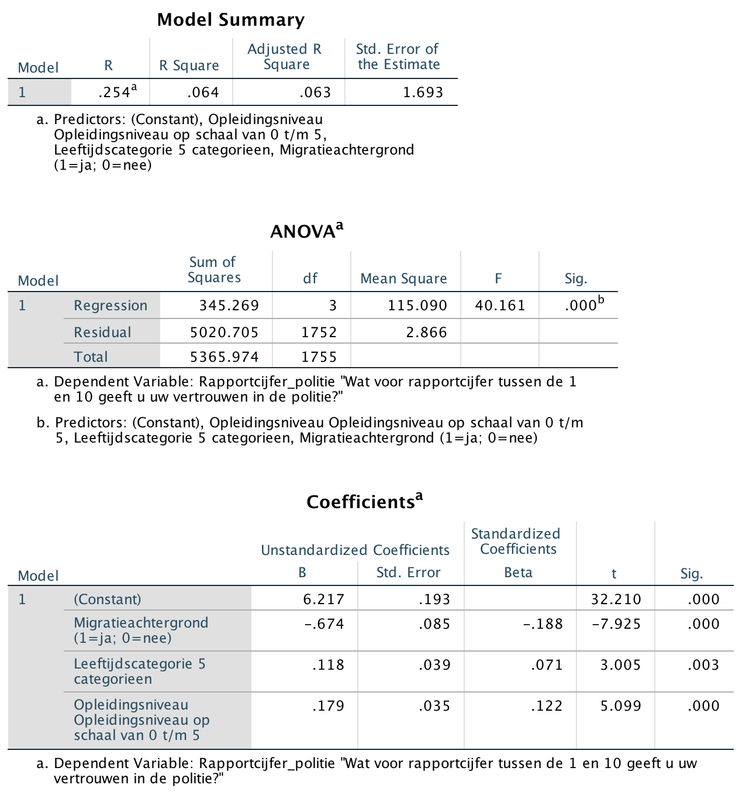

```{r, echo = FALSE, results = "hide"}
include_supplement("Screen__Shot__2020-04-30__at__15.36.58.png", recursive = TRUE)
```

Question
========
Below are the results of a multiple regression analysis with the degree of trust in the police (variable: **Police**) as the dependent variable, measured on a scale ranging from 1 (very little trust) to 10 (very much trust). The three independent variables in the model are:  
  

- **Migration background**: 0 = no; 1 = yes.
- **Age category**: measured by a scale with five categories ranging from score 0 (16 to 19 years) to 4 (65 years or older).
- **Education level**: the highest education a respondent is is currently pursuing or has already completed, measured by a scale with six categories ranging from score 0 (no education at all) to score 5 (Scientific Education).  
      

Age category and education level have ordinal levels of measurement, but will be considered quantitative for convenience.  
  
Does age category have a significant impact on trust in the police? And from what can you tell? The researcher tests two-sided with α = 0.05 (alpha =5%).   
  


Answerlist
----------
* **Yes**, age category has a significant influence because the **P value** is less than 0.05.
* **Yes**, age category has a significant influence because the **t-value** is greater than 0.05.
* **Yes**, age category has a significant influence because the **Beta** (standardized b coefficient) is greater than 0.05.
* **No**, age category has *no* significant influence, because the **Beta** (standardized b coefficient) is greater than 0.05.
* **No**, age category has *no* significant influence because the **t-value** is greater than 0.05.
* **No**, age category has *no* significant influence because the **P-value** is smaller than 0.05.

Solution
========

Language Dutch

Levels of Difficulty Easy

M&T Basics of quantitative research Basics of quantitative research

M&T BIS Default value
Answerlist
----------
* True
* False
* False
* False
* False
* False

Meta-information
================
exname: vufsw-pvalue-0102-en
extype: schoice
exsolution: 100000
exshuffle: TRUE
exsection: inferential statistics/nhst/p-value
exextra[ID]: 7d496
exextra[Type]: interpretating output
exextra[Program]: NA
exextra[Language]: English
exextra[Level]: statistical literacy

