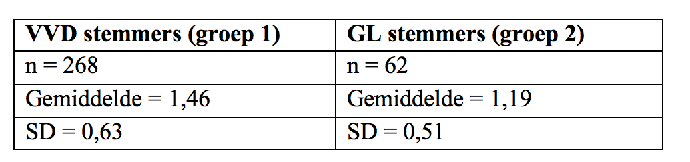

```{r, echo = FALSE, results = "hide"}
include_supplement("Screen__Shot__2019-03-02__at__20.02.38.png", recursive = TRUE)
```

Question
========
Suppose we want to test whether there is a significant difference between VVD voters and GreenLeft voters in the extent to which they think the Earth's climate is changing. Based on the *European Social Survey* the results below.  
The observed P-value in a two-sided test turns out to be 0.002 are. What can we conclude from this?   
  


Answerlist
----------
* The probability is 0.2% that the null hypothesis is not TRUE.
* The probability is 0.2% that the null hypothesis is true.
* The probability is 0.2% that we observe this difference (or an even greater difference) if the alternative hypothesis is TRUE.
* The probability is 0.2% that we observe this difference (or an even greater difference) if the null hypothesis is TRUE.

Solution
========

Language Dutch

Levels of Difficulty Easy

M&T Basics of quantitative research Basics of quantitative research

M&T BIS Default value
Answerlist
----------
* False
* False
* True
* False

Meta-information
================
exname: vufsw-pvalue-0216-en
extype: schoice
exsolution: 0010
exshuffle: TRUE
exsection: inferential statistics/nhst/p-value
exextra[Type]: conceptual
exextra[Program]: NA
exextra[Language]: English
exextra[Level]: statistical literacy

