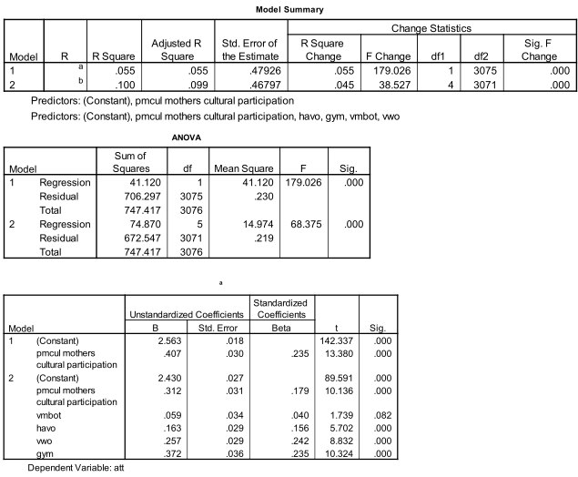

```{r, echo = FALSE, results = "hide"}
include_supplement("Schermafbeelding__2019-01-30__om__14.25.40.png", recursive = TRUE)
```

Question
========

  
In the above analysis, the dependent variable is attitude toward culture (1-4, higher score = more positive attitude). The independent variables are school level (in dummies, vmbo-b is the reference category) and mothers' cultural participation (continuous scale 0-1, 0= least active, 1 = most active).  
  
How is it tested whether school level makes a significant contribution to explaining attitude differences?

Answerlist
----------
* Via the adjusted R-square of .099
* Via the F-value of 38.527
* Via the F-value of 68.375
* Via the t-values of 1.739, 5.702, 8.832, 10.324 collectively

Solution
========

Answerlist
----------
* False
* True
* False
* False

Meta-information
================
exname: vufsw-r squared change-2057-en
extype: schoice
exsolution: 0100
exshuffle: TRUE
exsection: inferential statistics/regression/multiple linear regression/r squared change
exextra[ID]: 47dfe
exextra[Type]: interpreting output
exextra[Program]: NA
exextra[Language]: English
exextra[Level]: statistical literacy

