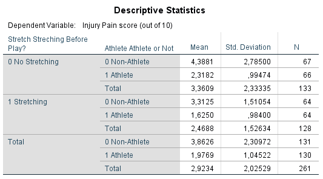

```{r, echo = FALSE, results = "hide"}
include_supplement("1606310848601.png", recursive = TRUE)
include_supplement("1606310861407.png", recursive = TRUE)
include_supplement("1606310896679.png", recursive = TRUE)
include_supplement("1606310920191.png", recursive = TRUE)
```

Question
========
Field beweert dat er een toename is in het aantal spierblessures als
gevolg van het spelen van het computerspel Wii van Nintendo. Een
onderzoekster verwacht dat mensen die sporten hier minder last van
hebben, omdat ze al gewend zijn aan lichaamsbeweging. Voor de
niet-sporters verwacht ze dat een warming-up voorafgaand aan een Wii
sessie zal helpen om deze blessures te voorkomen.  
  
Om dit te onderzoeken selecteert ze 120 sporters en 120 niet-sporters
(‘athlete’ - yes(1)/no(0)). Binnen elk van beide groepen werden de
deelnemers vervolgens random aan twee groepen toegewezen: de helft moest
een stretching (warming-up) doen van 5 minuten, en de andere helft niet
(variabele ‘stretch’ - yes(1)/no(0)). Bij alle deelnemers werden na
afloop van de 4 uur durende Wii sessie de pijnklachten gemeten op een
schaal van 1-10 (‘injury’; 0 = geen pijn, 10 = sterke pijn).  
  
Hieronder staan de resultaten van de analyse.  
  
 
  
  
 
  
De ‘variance ratio’ is een manier om de assumptie van de homogeniteit
van varianties te onderzoeken. In dit onderzoek geldt 3 als grenswaarde
voor hoeveel keer groter de grootste ‘within-group’ variantie mag zijn
ten opzichte van de kleinste ‘within-group’ variantie.  
  
**Variance ratio = largest ‘within-group variance’/ smallest
‘within-group variance’**  
  
Is volgens de ‘variance ratio’ aan de assumptie van homogeniteit van
varianties voldaan?

Answerlist
----------
* De variance ratio is kleiner dan 3, daarom kunnen we niet uitgaan van
  een gelijke ‘within-group’ variantie tussen de groepen
* De variance ratio is kleiner dan 3, daarom kunnen we uitgaan van een
  gelijke ‘within-group’ variantie tussen de groepen
* De variance ratio is groter dan 3, daarom kunnen we niet uitgaan van een
  gelijke ‘within-group’ variantie tussen de groepen
* De variance ratio is groter dan 3, daarom kunnen we uitgaan van een
  gelijke ‘within-group’ variantie tussen de groepen

Solution
========


Answerlist
----------
* False
* False
* True
* False

Meta-information
================
exname: vufsw-ratio of variance-1330-nl
extype: schoice
exsolution: 0010
exshuffle: TRUE
exsection: assumptions/homogeneity of variance/ratio of variance
exextra[Type]: interpreting output
exextra[Program]: calculator
exextra[Language]: Dutch
exextra[Level]: statistical thinking

