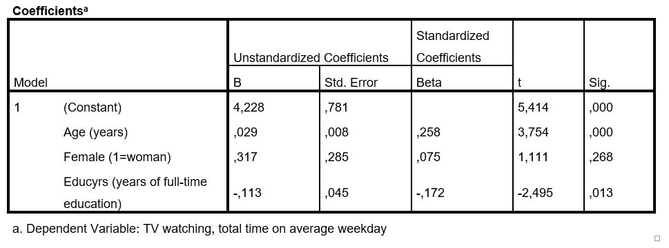

```{r, echo = FALSE, results = "hide"}
include_supplement("1553595822664.png", recursive = TRUE)
```

Question
========
A researcher conducts a multiple regression to determine which factors influencing how much a person watches television (Y). The data used comes from the *European Social Survey* from 2014. The questionnaire was administered to a random sample of the population of the Netherlands aged 18 years and older (N=1362). The extent to which someone watches television was measured with a question where the response options ranged from 1 ("less than half an hour a day") to 7 ("more than three hours a day"). Education (**Educyrs**) was measured in number of years of education completed; scores on this variable range from 0 years to 28 years. The researcher obtains the following results.  
Fill in the appropriate texts:  
  
If we compare someone of average age (an "average" person) compare with someone one year older than the average, we expect a higher degree of viewing behavior from
* Expressed on a scale ** **Less than the average, we expect a higher degree of viewing behavior of **Less than the average.  
  


Answerlist
----------
* **Text 1:** 0.029. **Text 2:** from 1 to 7.
* **Text 1:** 0.029. **Text 2:** from -1 through +1.
* **Text 1:** 0.258. **Text 2:** from 1 to 7.
* **Text 1:** 0.258. **Text 2:** from -1 through +1.

Solution
========

Language Dutch

Levels of Difficulty Easy

M&T Basics of quantitative research Basics of quantitative research

M&T BIS Default value
Answerlist
----------
* True
* False
* False
* False

Meta-information
================
exname: vufsw-regression-0031-en
extype: schoice
exsolution: 1000
exshuffle: TRUE
exsection: inferential statistics/regression
exextra[Type]: interpretation output
exextra[Program]: NA
exextra[Language]: English
exextra[Level]: statistical literacy

