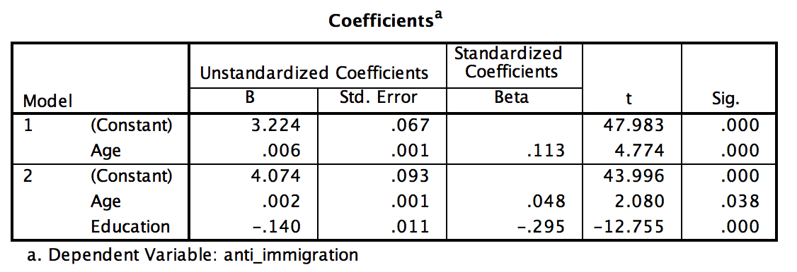

```{r, echo = FALSE, results = "hide"}
include_supplement("Screen__Shot__2019-05-09__at__16.41.16.png", recursive = TRUE)
```

Question
========
Below are the results of a single regression (Model 1) and multiple regression (Model 2). The dependent variable "**anti-immigration**" is attitude toward immigration, where the scale ranges from 1 (very positive attitude) to 5 (very negative attitude). "**Age**" is age in years and "**Education**" measures one's education level, where the scale runs from 1 (low education) to 8 (highly educated). The data is from the Dutch Voters Survey 2017.  
What percentage of the effect of age on Y is explained by taking differences in education level into account? (Round to 1 decimal place)   
  


Answerlist
----------
* 54,8%
* 47,7%
* 30,9%
* 66,7%

Solution
========

Language Dutch

Levels of Difficulty Easy

M&T Basics of quantitative research Basics of quantitative research

M&T BIS Default value
Answerlist
----------
* False
* False
* False
* True

Meta-information
================
exname: vufsw-regression-0072-en
extype: schoice
exsolution: 0001
exshuffle: TRUE
exsection: inferential statistics/regression
exextra[ID]: 69f47
exextra[Type]: calculation
exextra[Program]: calculator
exextra[Language]: English
exextra[Level]: statistical literacy

