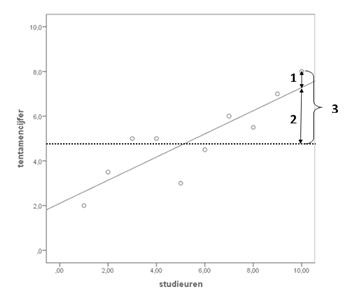

```{r, echo = FALSE, results = "hide"}
include_supplement("image003.jpg", recursive = TRUE)
```

Question
========
The figure below shows a regression line, and three line segments. The horizontal line represents the mean. For each of the three figures in the graph, indicate which term applies to it applicable to it.  


Answerlist
----------
* 1: residual sum of squares, 2: regression sum of squares (or model sum of squares), 3: total sum of squares.
* 1: regression sum of squares (or model sum of squares), 2: residual sum of squares, 3: total sum of squares.
* 1: total sum of squares, 2: regression sum of squares (or model sum of squares), 3: residual sum of squares.
* 1: residual sum of squares, 2: total sum of squares, 3: regression sum of squares (or model sum of squares).

Solution
========

Answerlist
----------
* True
* False
* False
* False

Meta-information
================
exname: vufsw-regression-1115-en
extype: schoice
exsolution: 1000
exshuffle: TRUE
exsection: inferential statistics/regression
exextra[Type]: conceptual
exextra[Program]: NA
exextra[Language]: English
exextra[Level]: statistical literacy

