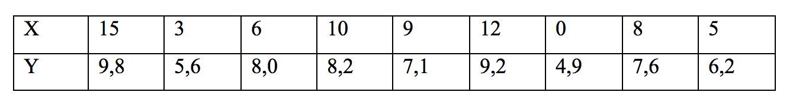

```{r, echo = FALSE, results = "hide"}
include_supplement("Screen__Shot__2019-02-21__at__00.36.04.png", recursive = TRUE)
```

Question
========
The table below gives the data of 9 students regarding their exam grade (Y), measured on a scale of 0 to 10, and attendance at lecture (X), measured in number of lectures attended.  
The formula associated with the regression line is ***ŷ***** = 5.2 + 0,4*****x***.  
  
What is the residual of the student who took 10 lectures and got the exam grade 8.2?  
  


Answerlist
----------
* -0,50
* -1,00
* -1,50
* -5,15
* -2,20

Solution
========

Language Dutch

M&T Basics of quantitative research Basics of quantitative research

M&T BIS Default value
Answerlist
----------
* False
* True
* False
* False
* False

Meta-information
================
exname: vufsw-residuals-0037-en
extype: schoice
exsolution: 01000
exshuffle: TRUE
exsection: inferential statistics/regression/residuals
exextra[ID]: a71e7
exextra[Type]: calculation
exextra[Program]: calculator
exextra[Language]: English
exextra[Level]: statistical literacy

