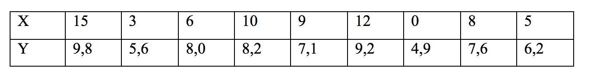

```{r, echo = FALSE, results = "hide"}
include_supplement("Screen__Shot__2019-02-21__at__00.36.04.png")
```

Question
========
Onderstaande tabel geeft de gegevens van 9 studenten betreft hun
tentamencijfer (**Y**), gemeten op een schaal van 0 tot 10, en
aanwezigheid bij college (**X**), gemeten in aantal gevolgde colleges.  
De formule die bij de regressielijn hoort is *ŷ* = 5,2 + 0,4*x*.  
  
Wat is het residu van de student die 6 colleges heeft gevolgd en het
tentamencijfer 8,0 heeft gehaald?  
  


Answerlist
----------
* 0,4
* 1,0
* 1,5
* 0,1
* 2,6
* 1,9

Solution
========


Answerlist
----------
* True
* False
* False
* False
* False
* False

Meta-information
================
exname: vufsw-residuals-0175-nl
extype: schoice
exsolution: 100000
exshuffle: TRUE
exsection: inferential statistics/regression/residuals
exextra[Type]: calculation
exextra[Program]: calculator
exextra[Language]: Dutch
exextra[Level]: statistical thinking

