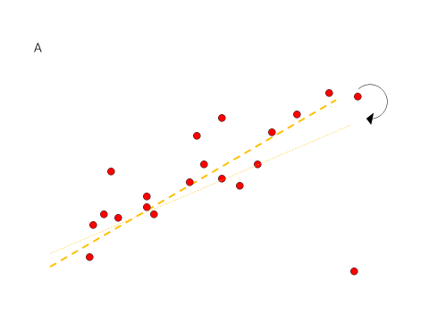
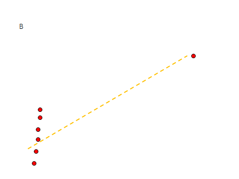

```{r, echo = FALSE, results = "hide"}
include_supplement("1605789338258.png", recursive = TRUE)
include_supplement("1605789327215.png", recursive = TRUE)
```

Question
========
           
 
  
In which of the above situations are the standardized residuals a way to detect the anomalous case?

Answerlist
----------
* Only in situation A
* Only in situation B
* In both situations
* In neither situation

Solution
========

Answerlist
----------
* True
* False
* False
* False

Meta-information
================
exname: vufsw-residuals-1308-en
extype: schoice
exsolution: 1000
exshuffle: TRUE
exsection: inferential statistics/regression/residuals
exextra[Type]: conceptual
exextra[Program]: NA
exextra[Language]: English
exextra[Level]: statistical reasoning

