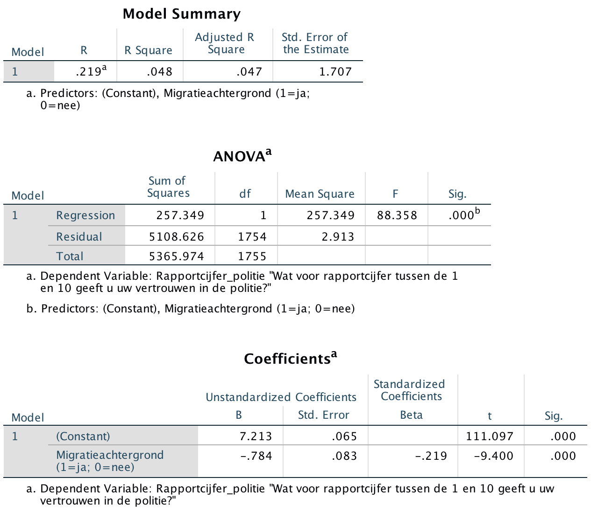

```{r, echo = FALSE, results = "hide"}
include_supplement("Screen__Shot__2020-04-30__at__15.09.34.png", recursive = TRUE)
```

Question
========
The researcher conducts a single regression analysis with the degree of trust in the police (variable: "**Police Report Rate**") as the dependent variable and the dummy variable "**Migrant background**" as the independent variable.  
What is the explained variance of this regression model?   
  


Answerlist
----------
* 4,8%
* 2,19%
* 21,9%
* 0,22%
* 0,048%

Solution
========

Language Dutch

Levels of Difficulty Easy

M&T Basics of quantitative research Basics of quantitative research

M&T BIS Default value
Answerlist
----------
* True
* False
* False
* False
* False

Meta-information
================
exname: vufsw-rsquared-0087-en
extype: schoice
exsolution: 10000
exshuffle: TRUE
exsection: inferential statistics/regression/r squared
exextra[ID]: 5032c
exextra[Type]: interpretating output
exextra[Program]: NA
exextra[Language]: English
exextra[Level]: statistical literacy

