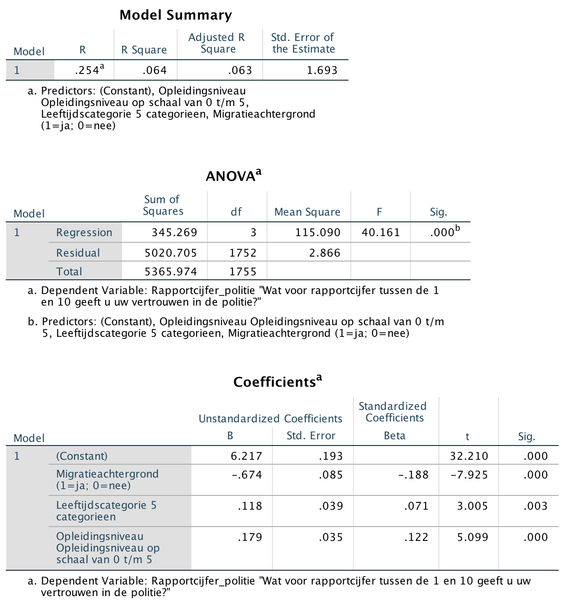

```{r, echo = FALSE, results = "hide"}
include_supplement("Screen__Shot__2020-04-30__at__15.36.58.png", recursive = TRUE)
```

Question
========
Below are the results of a multiple regression analysis with the degree of trust in the police (variable: "**Police**") as the dependent variable, measured on a scale ranging from 1 (very little trust) to 10 (very much trust). The three independent variables in the model are:  
  

- **Migration background**: 0 = no; 1 = yes.
- **Age category**: measured by a scale with five categories ranging from score 0 (16 to 19 years old) to 4 (65 years old or older).
- **Education level**: the highest education a respondent is is currently pursuing or has already completed, measured by a scale with six categories ranging from score 0 (no education at all) to score 5 (Scientific Education).  
      

Age category and education level have ordinal levels of measurement, but will be considered quantitative for convenience.  
Suppose we remove the variable Migration Background** **from our regression model. remove. Will the **explained variance** then decrease, stay the same, or increase?  
  


Answerlist
----------
* T will remain the same because the explained variance is *not* depends on the number of independent variables in the model.
* It will increase because this independent variable has a negative influence on Y.
* It will decrease because this independent variable has a significant influence on Y.
* It will increase because the number of independent variables in the model decreases.
* This will remain the same, because it will increase the measurement level of the dependent variable (Y) in the model is *not* affected by this.

Solution
========

Language Dutch

Levels of Difficulty Easy

M&T Basics of quantitative research Basics of quantitative research

M&T BIS Default value
Answerlist
----------
* False
* False
* True
* False
* False

Meta-information
================
exname: vufsw-rsquared-0121-en
extype: schoice
exsolution: 00100
exshuffle: TRUE
exsection: inferential statistics/regression/r squared
exextra[ID]: 69e4b
exextra[Type]: conceptual
exextra[Program]: NA
exextra[Language]: English
exextra[Level]: statistical reasoning

