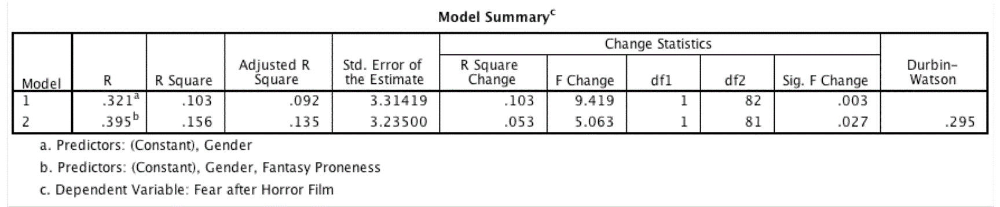

```{r, echo = FALSE, results = "hide"}
include_supplement("Capture5.gif", recursive = TRUE)
```

Question
========
Een consumentenonderzoeker was geïnteresseerd in welke factoren van invloed zijn op de angstreacties van mensen op horrorfilms. Ze mat het geslacht (0 = vrouw, 1 = man) en hoeveel iemand geneigd is te geloven in dingen die niet bestaan. mannelijk) en in hoeverre iemand geneigd is te geloven in dingen die niet echt zijn (fantasy proneness) op een schaal van 0 tot 4 (0 = helemaal niet echt). echt zijn (fantasiepatroon) op een schaal van 0 tot 4 (0 = helemaal niet fantasiegevoelig, 4 = zeer fantasiegevoelig). Angstreacties werden gemeten op een schaal van 0 (helemaal niet bang) tot 15 (het bangste gevoel dat ik ooit heb gehad). gevoeld). Hoeveel variantie (als percentage) in angst wordt gedeeld door geslacht en fantasiegevoeligheid in de **populatie**? Geef een percentage als antwoord zonder het %-symbool (bijvoorbeeld 10,1). Gebruik slechts één decimaal.  
  



Solution
========

Aangezien je gevraagd wordt om het percentage verklaarde variantie in de populatie, is het juiste antwoord de aangepaste R<sup>2</sup> en niet de R<sup>2</sup>.

Taal Engels

M&T MVA Standaardwaarde

M&T Regressie assumpties Standaardwaarde

Meta-information
================
exname: vufsw-rsquaredchange-1001-nl
extype: num
exsolution: 13.5
extol: 0
exsection: inferential statistics/regression/multiple linear regression/r squared change
exextra[Type]: interpretating output
exextra[Program]: NA
exextra[Language]: Dutch
exextra[Level]: statistical reasoning

