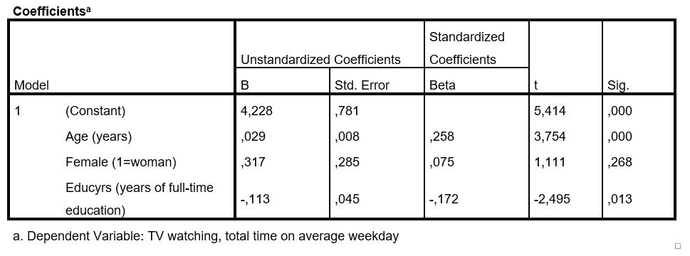

```{r, echo = FALSE, results = "hide"}
include_supplement("1553595822664.png", recursive = TRUE)
```

Question
========
A researcher conducts a multiple regression to determine which factors that influence the extent to which a person watches television (**Y**). The data used comes from the *European Social Survey* from 2014. The questionnaire was administered to a random sample from the population of the Netherlands aged 18 years and older (N=1362). The extent to which a person watches television was measured with a question in which response options ranged from 1 ("less than half an hour per day") to 7 ("more than three hours a day"). Education ("**Educyrs**") was measured in number of years of education completed; scores on this variable range from 0 years to 28 years. The researcher obtains the results below. The researcher examines whether the three independent variables have an impact on Y and conducts a test conducted. He uses a significance level of 5% (α = .05).  
  
Which of the following conclusions is correct?  
  


Answerlist
----------
* Age has a significant positive effect on the level of TV viewing. Women watch TV significantly more often than men.
* Age has a significant positive effect on the extent of TV watching. Men watch TV significantly more often than women.
* Age has a significant positive effect on the extent of TV watching. The number of years of education completed has a significant negative effect on the degree of TV watching.
* Age and years of education both have a significant positive effect on the degree of TV watching.
* Only age has a significant positive effect on the extent of TV watching. Gender and years of education have no significant effect on the degree of TV watching.

Solution
========

Answerlist
----------
* False
* False
* True
* False
* False

Meta-information
================
exname: vufsw-significancelevel-0156-en
extype: schoice
exsolution: 00100
exshuffle: TRUE
exsection: inferential statistics/nhst/significance level
exextra[ID]: 79bcb
exextra[Type]: interpretating output
exextra[Program]: NA
exextra[Language]: English
exextra[Level]: statistical literacy

