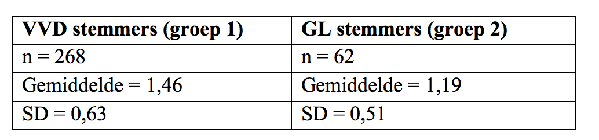

```{r, echo = FALSE, results = "hide"}
include_supplement("Screen__Shot__2019-03-02__at__20.02.38.png", recursive = TRUE)
```

Question
========
Suppose we want to test whether there is a significant difference between VVD voters and GreenLeft voters in the extent to which they think the Earth's climate is changing. We obtain from the *European Social Survey* (2016) the results below.  
What is the **observed t-value** when testing this hypothesis?  
  


Answerlist
----------
* 3,58
* 2,66
* 4,01
* 4,77

Solution
========

Language Dutch

Levels of Difficulty Easy

M&T Basics of quantitative research Basics of quantitative research

M&T BIS Default value
Answerlist
----------
* True
* False
* False
* False

Meta-information
================
exname: vufsw-significancelevel-0212-en
extype: schoice
exsolution: 1000
exshuffle: TRUE
exsection: inferential statistics/nhst/significance level
exextra[ID]: 5d46f
exextra[Type]: calculation
exextra[Program]: calculator
exextra[Language]: English
exextra[Level]: statistical literacy

