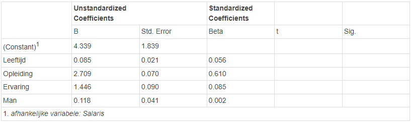

```{r, echo = FALSE, results = "hide"}
include_supplement("1645520093057.png", recursive = TRUE)
```

Question
========
Given is the following SPSS output, in which the results of a regression analysis are presented, based on a sample among 800 Dutch people. As you can see, the t-values and p-values are missing. The dependent variable is the salary a person receives. Age (in years), education (in years), work experience (in years), and gender ('female' is the reference category) are the independent variables. One-sided testing is performed with a significance level of 5% ( = 0,05).  
Which of the four independent variables have a significant influence on salary?   
  


Answerlist
----------
* Age, education, work experience and gender.
* Age and education.
* Age, education, and work experience.
* Age, education, and gender.

Solution
========

Answerlist
----------
* True
* False
* False
* False

Meta-information
================
exname: vufsw-significancelevel-1103-en
extype: schoice
exsolution: 1000
exshuffle: TRUE
exsection: inferential statistics/nhst/significance level
exextra[Type]: performing analysis
exextra[Program]: calculator
exextra[Language]: English
exextra[Level]: statistical thinking

