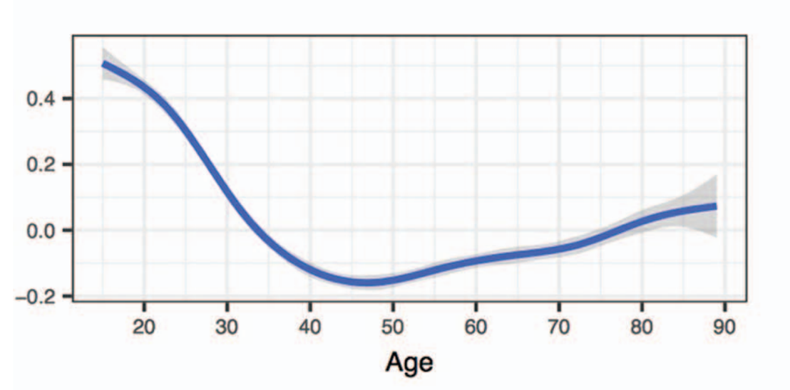

```{r, echo = FALSE, results = "hide"}
include_supplement("1615903677730.png", recursive = TRUE)
```

Question
========
A group of researchers are interested in perceived age discrimination and wants to know if perceived age discrimination is influenced by a person's age. The expectation is that both younger and older people experience more age discrimination than middle-aged people. They are analyzing data from the 2008/2009 *European Social Survey*, which consists of data from 28 countries.  
  
For a group of countries, they find the following observed relationship between X and Y in the figure below.  
Based on this figure, are these good data for a single linear regression analysis?   
  
* Source: Bratt, C., Abrams, D., Swift, H.J., Vauclair, C.-M., & Marques, S. (2018). Perceived Age Discrimination Across Age in Europe: From an Ageing Society to a Society for All Ages, Developmental Psychology, 54(1), 167-180.)*  
  


Answerlist
----------
* No, because this graph shows that the conditional standard deviation (s<sub>res</sub>) at certain ages is very different from 0 (especially in younger people).
* No, because this graph shows that people of certain ages are are less represented in this sample than people of other ages (especially middle-aged people are underrepresented).
* No, because this graph shows that there is no linear relationship between X and Y.
* We can't say that based on just this information; we can assess the assumptions in a regression analysis on the basis of this data.

Solution
========

Answerlist
----------
* False
* False
* True
* False

Meta-information
================
exname: vufsw-simple linear regression-0219-en
extype: schoice
exsolution: 0010
exshuffle: TRUE
exsection: inferential statistics/regression/simple linear regression
exextra[ID]: 0cc10
exextra[Type]: interpretating graph
exextra[Program]: NA
exextra[Language]: English
exextra[Level]: statistical reasoning

