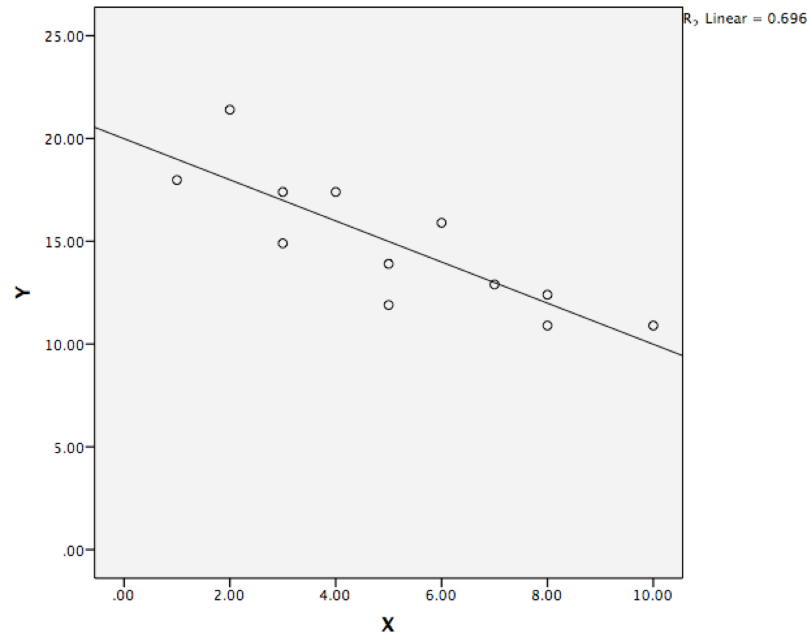

```{r, echo = FALSE, results = "hide"}
include_supplement("Screen__Shot__2019-08-10__at__22.19.05.png", recursive = TRUE)
```

Question
========
A regression line is shown below, based on data from 12 observations.  
What is the best estimate of the b coefficient of this regression equation?   
  


Answerlist
----------
* B = -1,00
* B = -10,00
* B = -0,10
* B = -20,00
* B = -0,50
* B = -7,00

Solution
========

Answerlist
----------
* True
* False
* False
* False
* False
* False

Meta-information
================
exname: vufsw-simple linear regression-0166-en
extype: schoice
exsolution: 100000
exshuffle: TRUE
exsection: inferential statistics/regression/simple linear regression
exextra[Type]: interpretating graph
exextra[Program]: NA
exextra[Language]: English
exextra[Level]: statistical literacy

