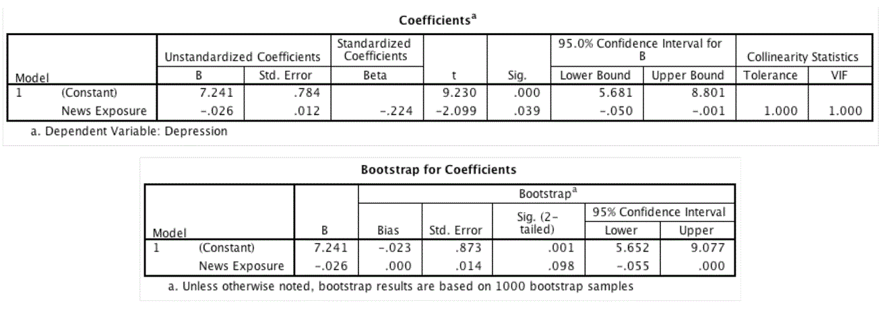

```{r, echo = FALSE, results = "hide"}
include_supplement("Capture2.gif", recursive = TRUE)
```

Question
========
Een psycholoog was geïnteresseerd in de vraag of de hoeveelheid nieuws die mensen kijken (minuten per dag) voorspelt hoe depressief ze zijn (van 0 = niet depressief tot 7 = zeer depressief). Wat betekent de interpretatie van de constante?  
  


Answerlist
----------
* De gemiddelde depressie wanneer de variabele nieuws gelijk is aan het gemiddelde.
* De gemiddelde depressie is 7,241 wanneer de blootstelling aan nieuws met 1 eenheid toeneemt.
* Als de blootstelling aan nieuws met 1 minuut toeneemt, neemt de depressie toe met 7,241 eenheden.
* De gemiddelde depressie is 7,241 wanneer de blootstelling aan nieuws nul is.

Solution
========

Dit is de definitie van de interpretatie van de constante. De constante vertegenwoordigt de gemiddelde waarde van de afhankelijke variabele Y wanneer alle onafhankelijke variabelen gelijk zijn aan nul.

Taal Engels

M&T MVA Standaardwaarde

M&T Regressie assumpties Standaardwaarde
Answerlist
----------
* Onwaar
* Onwaar
* Onwaar
* Waar

Meta-information
================
exname: vufsw-simplelinearregression-1005-nl
extype: schoice
exsolution: 0001
exshuffle: TRUE
exsection: inferential statistics/regression/simple linear regression
exextra[Type]: interpretating output
exextra[Program]: NA
exextra[Language]: Dutch
exextra[Level]: statistical reasoning

