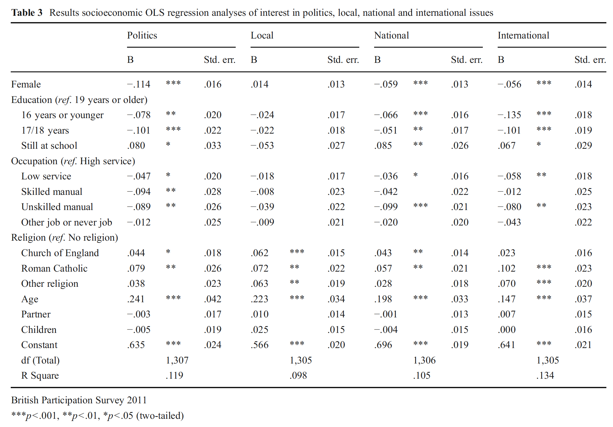

```{r, echo = FALSE, results = "hide"}
include_supplement("Screen__Shot__2021-03-25__at__16.09.25.png", recursive = TRUE)
```

Question
========
The table below is taken from an article by Hilde Coffé from 2013.  
Look at the column of the variable "**Politics**". This dependent variable measures one's interest in politics, measured on a scale that runs from 1 ("not at all interested") to 4 ("very interested").  
  
We want to know the effect of gender. The dummy variable "**Female**" (see first row in the table) is coded as follows: 0=male; 1=female. How should we interpret the b coefficient of -0.114 that reflects the effect represents the effect of gender on the level of interest in politics ("**Politics**")?  
  
<sub>(source:Coffé,‗Women stay local,‗men go national and global,‗ Gender differences in political interest.  


Answerlist
----------
* Men score 0.114 point lower on interest in politics than women, controlled for the other variables in the model.
* Women score 0.114 point lower on interest in politics than men, controlled for the other variables in the model.
* The proportion of men who are interested in politics is 11.4 percent point lower than the proportion of women interested in politics, controlled for the other variables in the model.
* The proportion of women interested in politics is 11.4 percent point lower than the proportion of men interested in politics, controlled for the other variables in the model.

Solution
========

Answerlist
----------
* False
* True
* False
* False

Meta-information
================
exname: vufsw-slope-0220-en
extype: schoice
exsolution: 0100
exshuffle: TRUE
exsection: inferential statistics/regression/slope
exextra[ID]: 88d4d
exextra[Type]: interpretating output
exextra[Program]: NA
exextra[Language]: English
exextra[Level]: statistical literacy

