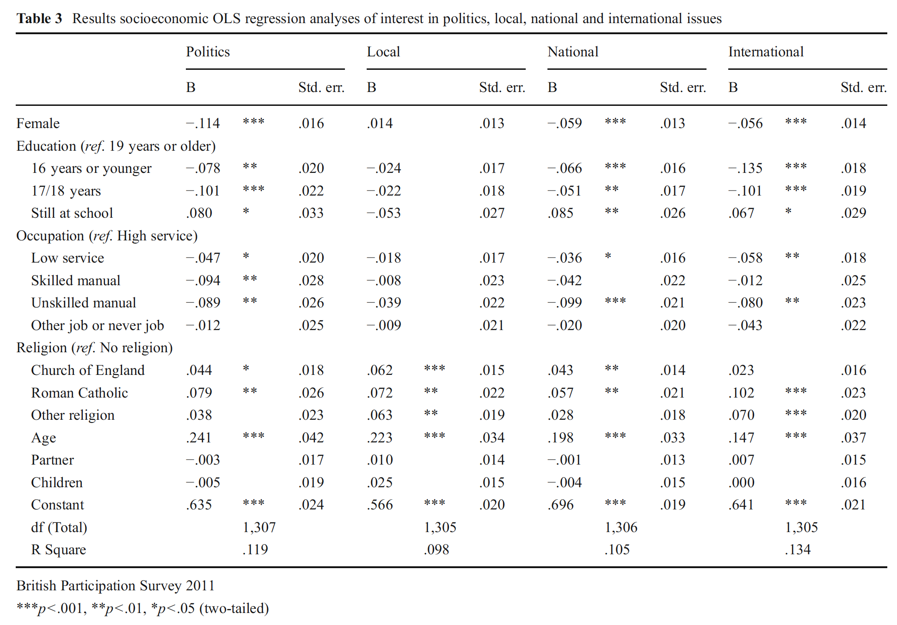

```{r, echo = FALSE, results = "hide"}
include_supplement("Screen__Shot__2021-03-25__at__16.09.25.png", recursive = TRUE)
```

Question
========
De onderstaande tabel is afkomstig uit een artikel van Hilde Coffé uit
2013.  
Kijk naar de kolom van de variabele "**Politics**". Deze afhankelijke
variabele meet iemands interesse in politiek, gemeten op een schaal die
loopt van 1 ("not at all interested") t/m 4 ("very interested").  
  
We willen het effect weten van geslacht. De dummy variabele "**Female**"
(zie eerste rij in de tabel) is als volgt gecodeerd: 0=man; 1=vrouw. Hoe
moeten we de b-coëfficiënt van -0,114 interpreteren dat het effect
weergeeft van geslacht op de mate van interesse in politiek
("**Politics**")?  
  
<sub>(bron:\ Coffé,\ H.\ (2013).\ "Women\ stay\ local,\ men\ go\ national\ and\ global?\ Gender\ differences\ in\ political\ interest."\ *Sex\ Roles,\ 69, *323-338)</sub>  


Answerlist
----------
* Mannen scoren 0,114 punt lager op interesse in politiek dan vrouwen,
  gecontroleerd voor de andere variabelen in het model.
* Vrouwen scoren 0,114 punt lager op interesse in politiek dan mannen,
  gecontroleerd voor de andere variabelen in het model.
* Het aandeel mannen dat interesse heeft in politiek ligt 11,4 procent
  punt lager dan het aandeel vrouwen dat interesse heeft in politiek,
  gecontroleerd voor de andere variabelen in het model.
* Het aandeel vrouwen dat interesse heeft in politiek ligt 11,4 procent
  punt lager dan het aandeel mannen dat interesse heeft in politiek,
  gecontroleerd voor de andere variabelen in het model.

Solution
========


Answerlist
----------
* False
* True
* False
* False

Meta-information
================
exname: vufsw-slope-0220-nl
extype: schoice
exsolution: 0100
exshuffle: TRUE
exsection: inferential statistics/regression/slope
exextra[ID]: b118a
exextra[Type]: interpretating output
exextra[Program]: NA
exextra[Language]: Dutch
exextra[Level]: statistical literacy

