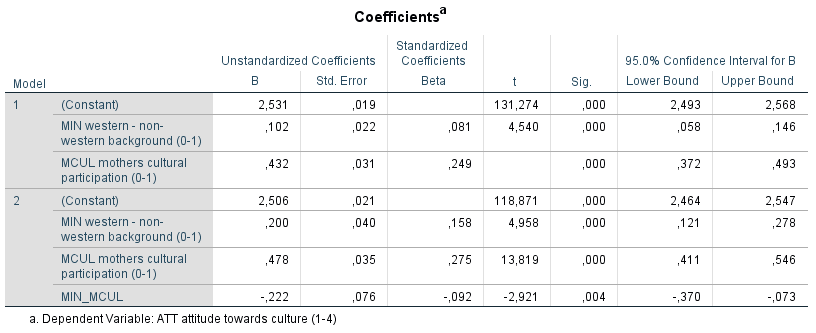

```{r, echo = FALSE, results = "hide"}
include_supplement("1606660757397.png", recursive = TRUE)
```

Question
========
The analyses below are derived from data from the research project Youth and Culture (Ganzeboom and Nagel, 1998-2002) in which More than 3,000 schoolchildren aged 14-17 were surveyed about their attitudes toward culture. Furthermore, information about their social background and their parents' cultural participation. The question is in to what extent the cultural participation of the mother influences the attitudes toward culture of schoolchildren, and whether this influence differs between schoolchildren from Western and non-Western backgrounds.  
  
The dependent variable is "Attitude toward culture" (ATT: a scale 1-4, where a higher score indicates a more positive attitude). Maternal cultural participation (MCUL) is a continuous scale, 0-1, where a higher score means higher participation. The Western versus non-western background of the schoolchildren was measured via the variable 'MIN' (0 = western, 1 = non-western). Also, in model 2, the interaction between 'MIN' and 'MCUL' included (MIN_MCUL).  

  
According to **regression model 1**, how much more positive or negative is the attitude towards culture of pupils from non-western background than that of schoolchildren with a Western background, holding maternal cultural participation held constant?

Answerlist
----------
* .102 points more positive on the 1-4 scale of attitude toward culture (ATT)
* .102 points more negative on the 1-4 scale of attitude toward culture (ATT)
* 2,429 points more negative on the 1-4 scale of attitude toward culture (ATT)
* 2.633 points more positive on the 1-4 scale of attitude toward culture (ATT)

Solution
========

Answerlist
----------
* True
* False
* False
* False

Meta-information
================
exname: vufsw-slope-1302-en
extype: schoice
exsolution: 1000
exshuffle: TRUE
exsection: inferential statistics/regression/slope
exextra[Type]: interpreting output
exextra[Program]: NA
exextra[Language]: English
exextra[Level]: statistical literacy

