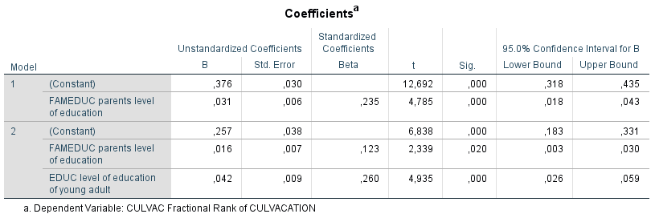

```{r, echo = FALSE, results = "hide"}
include_supplement("1606293471454.png", recursive = TRUE)
include_supplement("1606293416277.png", recursive = TRUE)
```

Question
========
The analyses below were conducted on data from a sample of young adults between the ages of 20 and 40 who were surveyed via a questionnaire about their cultural preferences. The research questions are (1) To what extent the preference for cultural vacations (variable: CULVAC (scale 0-1): a higher score means the preference for cultural vacations is stronger) is caused by the social position of the parental environment (measured is parental education (variable: FAMEDUC (scale 0-7), ranging from primary education (0) to university (7)) a higher score means higher education) and (2) whether this relationship can be explained by one's own achieved education level (variable: EDUC (scale 0-6), ranging from lower vocational education (0) to university (6)) a higher score means a higher education).  
  
Below are the results of two regression analyses.  
  
Regression analysis 1:  
  

  
  
Regression analysis 2:  
  

  
According to **model 1in the first regression analysis** respondents who grew up in families with the most educated parents compared to respondents who grew up in families with the least educated parents?

Answerlist
----------
* 0.031
* 0.217
* 0.407
* 0.593

Solution
========

Answerlist
----------
* False
* True
* False
* False

Meta-information
================
exname: vufsw-slope-1309-en
extype: schoice
exsolution: 0100
exshuffle: TRUE
exsection: inferential statistics/regression/slope
exextra[Type]: interpreting output
exextra[Program]: calculator
exextra[Language]: English
exextra[Level]: statistical literacy

