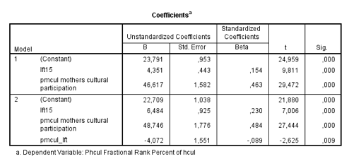

```{r, echo = FALSE, results = "hide"}
include_supplement("Schermafbeelding__2019-01-30__om__14.57.50.png", recursive = TRUE)
```

Question
========
In the output below, a sample of young people aged 14-17 years, the extent to which cultural participation (culpar: continuous scale 1-100: low -&gt; high) depends on age (lft15: in years, 15 years =0) and of mother's cultural participation (pmcul: continuous scale 0-1: low -&gt; high). An interaction term is also included between age and maternal cultural participation (lft|pmcul: calculated as lft15 pmcul).  
  

According to model 2, what is the difference in cultural participation at age 15 between young people with the least (pmcul = 0) and with the most (pmcul = 1) culturally active mother? *NB: in unstandardized units*

Answerlist
----------
* 44.674
* 48.746
* 51.158
* 55.230

Solution
========

Answerlist
----------
* False
* True
* False
* False

Meta-information
================
exname: vufsw-slope-2046-en
extype: schoice
exsolution: 0100
exshuffle: TRUE
exsection: inferential statistics/regression/slope
exextra[Type]: interpreting output
exextra[Program]: NA
exextra[Language]: English
exextra[Level]: statistical literacy

