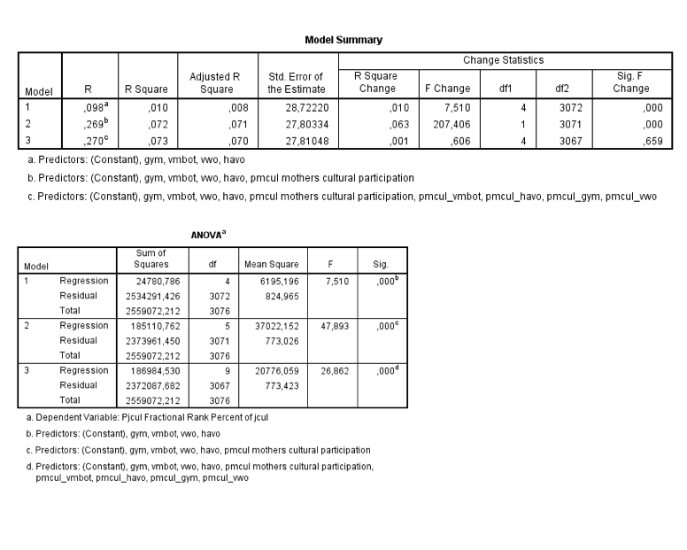

```{r, echo = FALSE, results = "hide"}
include_supplement("Schermafbeelding__2019-02-04__om__10.54.16.png", recursive = TRUE)
include_supplement("Schermafbeelding__2019-02-04__om__10.54.30.png", recursive = TRUE)
```

Question
========
We analyze data obtained from high school students in secondary education from the Youth & Culture Data (Ganzeboom & Nagel, 1998-2002). For this database, over 3,000 young people were surveyed in the age from roughly 14 to 17 years of age. In the regression analysis below, the participation in popular culture is the dependent variable (pjcul: 0-100, from little to much participation) and the independent variables maternal cultural participation (pmcul: 0-1, from least to most culturally active) and school level (in dummies, reference group = vmbo-b). Interactions between mothers' cultural participation and school level.  
  

According to model 1 in the sample, what is the score on popular culture of a vwo student?

Answerlist
----------
* 0.581
* 1.376
* 50.768
* 51.563

Solution
========

Answerlist
----------
* False
* False
* True
* False

Meta-information
================
exname: vufsw-slope-2101-en
extype: schoice
exsolution: 0010
exshuffle: TRUE
exsection: inferential statistics/regression/slope
exextra[ID]: 85135
exextra[Type]: interpreting output
exextra[Program]: NA
exextra[Language]: English
exextra[Level]: statistical literacy

