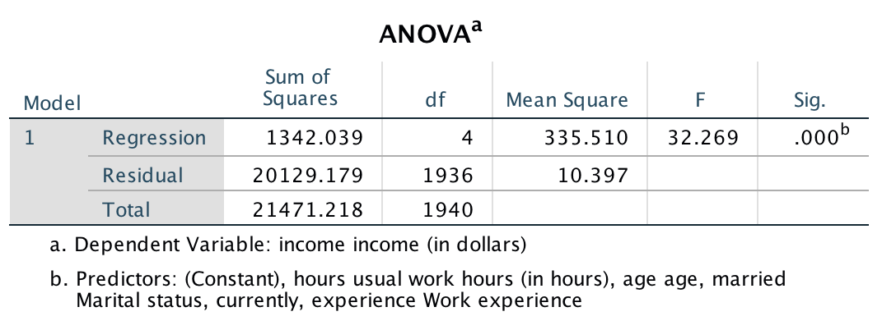

```{r, echo = FALSE, results = "hide"}
include_supplement("Screen__Shot__2021-03-18__at__16.28.58.png", recursive = TRUE)
```

Question
========
A portion of the results of a multiple regression analysis are shown.  
Based on the output below, calculate the **conditional standard deviation** (**s**<sub>**res**</sub>), also known as *residual standard deviation*.  
  


Answerlist
----------
* S<sub>res</sub> = 0.24
* S<sub>res</sub> = 1.88
* S<sub>res</sub> = 2.09
* S<sub>res</sub> = 3.22

Solution
========

Answerlist
----------
* False
* False
* False
* True

Meta-information
================
exname: vufsw-standarderroroftheestimate-0083-en
extype: schoice
exsolution: 0001
exshuffle: TRUE
exsection: inferential statistics/regression/standard error of the estimate
exextra[ID]: 76fe3
exextra[Type]: calculation
exextra[Program]: calculator
exextra[Language]: English
exextra[Level]: statistical reasoning

