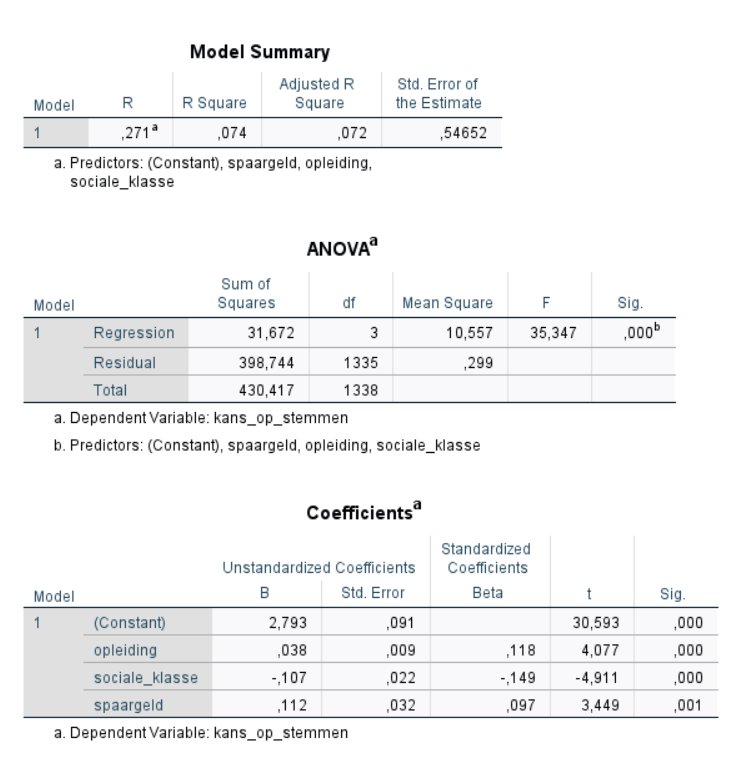

```{r, echo = FALSE, results = "hide"}
include_supplement("1620138066746.png", recursive = TRUE)
```

Question
========
See below the output of an investigation into an explanation of the likelihood of voting.  
A regression was conducted using education, social class and having savings as independent variables.   
Which variable has the greatest impact on the probability of voting?  
  


Answerlist
----------
* Savings, it has the largest B
* Social class, it has the largest negative Beta
* Education, it has the largest positive Beta
* You can't tell that from this output, additional analysis is needed needed

Solution
========

You have to look at the largest number at the Beta, whether that is positive or negative does not matter.

Answerlist
----------
* False
* True
* False
* False

Meta-information
================
exname: vufsw-standardizedcoefficient-0329-en
extype: schoice
exsolution: 0100
exshuffle: TRUE
exsection: inferential statistics/regression/standardized coefficient
exextra[ID]: cd74f
exextra[Type]: interpretating output
exextra[Program]: NA
exextra[Language]: English
exextra[Level]: statistical literacy

