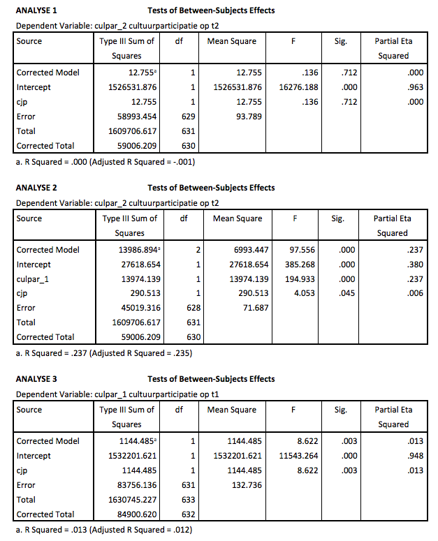
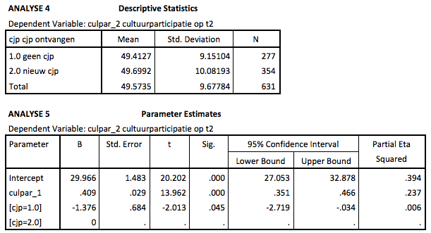

```{r, echo = FALSE, results = "hide"}
include_supplement("Schermafbeelding__2019-01-30__om__19.20.50.png", recursive = TRUE)
include_supplement("Schermafbeelding__2019-01-30__om__19.21.31.png", recursive = TRUE)
```

Question
========
Below are some output tables from a series of ANOVA and an ANCOVA analyses of cultural participation measured at time 1 (culpar\_1: before the CJP was distributed) and at time 2 (culpar_2) among the same respondents who can be divided into 2 groups be divided: a group that does not receive a cjp and a group that between time 1 and 2 received a CJP (a group that already had a cjp is excluded).  
  

  
What (original) sums of squares are you trying to reduce by adding a covariate?

Answerlist
----------
* 12.755
* 13974.139
* 58993.454
* 59006.209

Solution
========

Answerlist
----------
* False
* False
* True
* False

Meta-information
================
exname: vufsw-sum of squares-2067-en
extype: schoice
exsolution: 0010
exshuffle: TRUE
exsection: inferential statistics/regression/sum of squares
exextra[Type]: interpreting output
exextra[Program]: NA
exextra[Language]: English
exextra[Level]: statistical literacy

