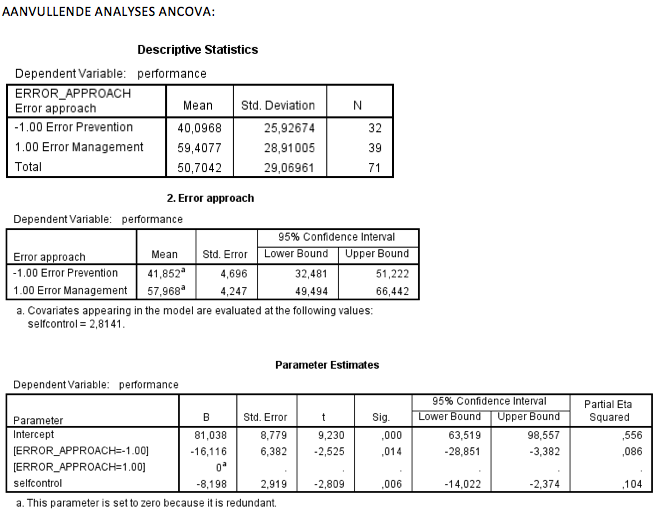

```{r, echo = FALSE, results = "hide"}
include_supplement("Schermafbeelding__2019-01-30__om__19.34.46.png", recursive = TRUE)
include_supplement("Schermafbeelding__2019-01-30__om__19.36.05.png", recursive = TRUE)
```

Question
========
In an experiment, participants were randomly divided into two groups (group variable: ERROR_APPROACH) who had to perform a task. The two groups were instructed differently beforehand: error prevention (" you are not allowed to make mistakes" ) and error management (" you are allowed to make mistakes make mistakes, you learn from them"). Below is a series of AN(C)OVA analyses TRUE examined whether error-approach affects how well the task was performed (PERFORMANCE). SELFCONTROL (degree of self-discipline, measured prior to the experiment) is a covariate in these analyses a covariate.  
  

  
What (original) sums of squares are you trying to reduce by adding a covariate?

Answerlist
----------
* 6554.826
* 47130.432
* 52598.120
* 59152.946

Solution
========

Answerlist
----------
* False
* False
* True
* False

Meta-information
================
exname: vufsw-sum of squares-2072-en
extype: schoice
exsolution: 0010
exshuffle: TRUE
exsection: inferential statistics/regression/sum of squares
exextra[ID]: 22cb0
exextra[Type]: interpreting output
exextra[Program]: NA
exextra[Language]: English
exextra[Level]: statistical literacy

