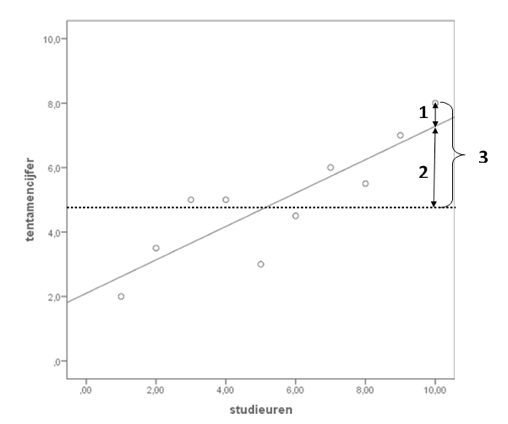

```{r, echo = FALSE, results = "hide"}
include_supplement("1616082387828.png", recursive = TRUE)
include_supplement("1642088671658.png", recursive = TRUE)
include_supplement("1642088671658.png", recursive = TRUE)
include_supplement("1642088671658.png", recursive = TRUE)
include_supplement("1642088671658.png", recursive = TRUE)
```

Question
========
In de onderstaande figuur staat een regressielijn weergegeven, en drie
lijnstukken. De horizontale lijn geeft het gemiddelde weer. Geef voor
elk van de drie cijfers in de grafiek aan welke term daar op van
toepassing is.  
  


Answerlist
----------
* 1: residual sum of squares, 2: regression sum of squares, 3: total sum
  of squares. 
* 1: regression sum of squares, 2: residual sum of squares, 3: total sum
  of squares.
* 1: total sum of squares, 2: regression sum of squares, 3: residual sum
  of squares.
* 1: residual sum of squares, 2: total sum of squares, 3: regression sum
  of squares.

Solution
========


Answerlist
----------
* True
* False
* False
* False

Meta-information
================
exname: vufsw-sumofsquares-0003-nl
extype: schoice
exsolution: 1000
exshuffle: TRUE
exsection: inferential statistics/regression/sum of squares
exextra[Type]: interpretating graph
exextra[Program]: NA
exextra[Language]: Dutch
exextra[Level]: statistical literacy

