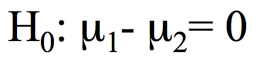
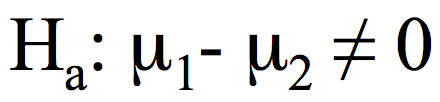

```{r, echo = FALSE, results = "hide"}
include_supplement("Screen__Shot__2020-02-22__at__13.52.54.png", recursive = TRUE)
include_supplement("Screen__Shot__2020-02-22__at__13.53.59.png", recursive = TRUE)
```

Question
========
Een aselecte steekproef van 15 studenten communicatiewetenschappen (groep 1) en van 15 studenten politicologie (groep 2) werden geselecteerd en gevraagd om te rapporteren op een schaal van 0 tot 100, hoe ze een bepaalde televisieserie evalueren. De resultaten staan in de tabel hieronder.  
  

<tabel> <tbody> <tr class="odd"> <td> </td> <td class="tvcss_2">N</td> <td class="tvcss_3">gemiddelde</td> <td class="tvcss_4">standaardafwijking</td> <td>standaardafwijking</td> </tr> <tr class="even"> <td>groep 1</td> <td class="tvcss_2">15</td> <td class="tvcss_3">59.31</td> <td class="tvcss_4">17.83</td> <td>4.95</td> </tr> <tr class="odd"> <td>groep 2</td> <td class="tvcss_2">15</td> <td class="tvcss_3">70,77</td> <td class="tvcss_4">17.36</td> <td>3.43</td> </tr> </tbody> </table>

  
De hypothese van de onderzoeker is dat studenten Communicatiewetenschap de televisieserie anders zullen evalueren dan studenten politicologie studenten. Vind de t-waarde voor de hypothese van de onderzoeker.

Answerlist
----------
* -0,07
* -1,78
* -1,96
* -2,68
* -3,11

Solution
========

De nulhypothese luidt:
De alternatieve hypothese luidt:
  
SE = √ ________[ (s<sub>1</sub><sup>2</sup>/n<sub>1</sub>) + (s<sub>2</sub><sup>2</sup>/n<sub>2</sub>) √] = √ \[(17,83<sup>2</sup>/15) + (17,36<sup>2</sup>/15) \] = 6,43  steekproefgrootten zijn gelijk.  
  
t = ( 59,31 - 70,77 ) / 6,43= -1,78  Als je meer wilt weten over het vergelijken van twee groepen en de t-test, kijk dan op
[this
clip](https://www.youtube.com/watch?v=A1lLo-np0KU&index=6&list=PLyLpEs0x9Bnl2e68nd7M6lecUqUNu2Sgn)

Taal Nederlands

Moeilijkheidsniveaus Gemiddeld

M&T BIS Standaardwaarde

M&T Hypothesetest: gemiddelden Standaardwaarde
Answerlist
----------
* Onwaar
* Waar
* Onwaar
* Onwaar
* Onwaar

Meta-information
================
exname: vufsw-t-statistic-1127-nl
extype: schoice
exsolution: 01000
exshuffle: TRUE
exsection: inferential statistics/nhst/test statistic/t-statistic
exextra[Type]: performing analysis
exextra[Program]: calculator
exextra[Language]: Dutch
exextra[Level]: statistical thinking

