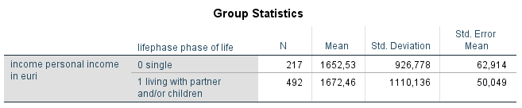
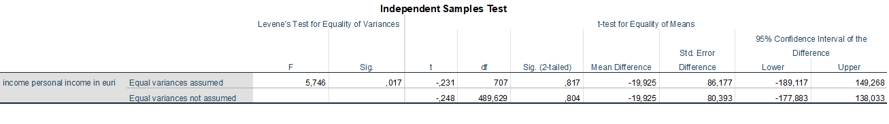

```{r, echo = FALSE, results = "hide"}
include_supplement("1606303597973.png", recursive = TRUE)
include_supplement("1606656759675.png", recursive = TRUE)
```

Question
========
In the following analysis of a 2007 Dutch sample, we examined whether personal income between singles and cohabitants (with partner and/or children) differs. The net income is in euros.  
  

  
  
  
  

  
From the output we can see that ....

Answerlist
----------
* Singles have a higher average income than cohabitants, but that the difference is not significant
* Singles have a higher average income than cohabitants and that the difference is significant
* Cohabitants on average have a higher income than singles, but that the difference is not significant
* Cohabitants have, on average, a higher income than singles and that the difference is significant

Solution
========

Answerlist
----------
* False
* False
* True
* False

Meta-information
================
exname: vufsw-t-test-1323-en
extype: schoice
exsolution: 0010
exshuffle: TRUE
exsection: inferential statistics/parametric techniques/t-test
exextra[ID]: 65ca2
exextra[Type]: interpreting output
exextra[Program]: NA
exextra[Language]: English
exextra[Level]: statistical thinking

