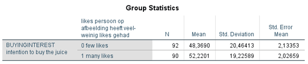
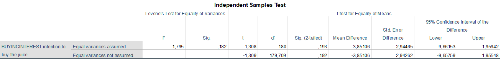

```{r, echo = FALSE, results = "hide"}
include_supplement("1606304344735.png", recursive = TRUE)
include_supplement("1606304365205.png", recursive = TRUE)
include_supplement("1606304444025.png", recursive = TRUE)
include_supplement("1606657035734.png", recursive = TRUE)
```

Question
========
In an experiment on the effect of food marketing on purchase intentions (Laura Sjardin, Josephine Ruijs, Nora Michon and Lianne van der Poel, 2017), 182 respondents were given a picture on Instagram of a healthy "juice" (fruit juice). The respondents were randomly divided into two groups: half were shown a photo of the juice that had 28 likes; the other half a photo of a juice that had 106,613 likes. Then the respondents had to indicate to what extent to what extent they would intend to buy the juice ("buyinginterest": a higher score means a higher buying intention). The question was whether the showing a juice with many likes leads to a higher buying intention than a juice with few likes.  
  
28 likes: 106,613 likes:  
  
 
  
Below are the results of an independent t-test.  
  

  
  

  
From the results of the analysis, we can see that...

Answerlist
----------
* The intention to buy the juice is greater when the juice has many 'likes' than when the juice has few 'likes'; the difference is not significant
* Intention to buy the juice is greater when the juice has many likes than when the juice has few likes; the difference is significant
* The intention to buy the juice is lower when the juice has many likes' than when the juice has few likes; the difference is not significant
* The intention to buy the juice is less when the juice has many likes' than when the juice has few likes; the difference is significant

Solution
========

Answerlist
----------
* True
* False
* False
* False

Meta-information
================
exname: vufsw-t-test-1326-en
extype: schoice
exsolution: 1000
exshuffle: TRUE
exsection: inferential statistics/parametric techniques/t-test
exextra[Type]: interpreting output
exextra[Program]: NA
exextra[Language]: English
exextra[Level]: statistical thinking

