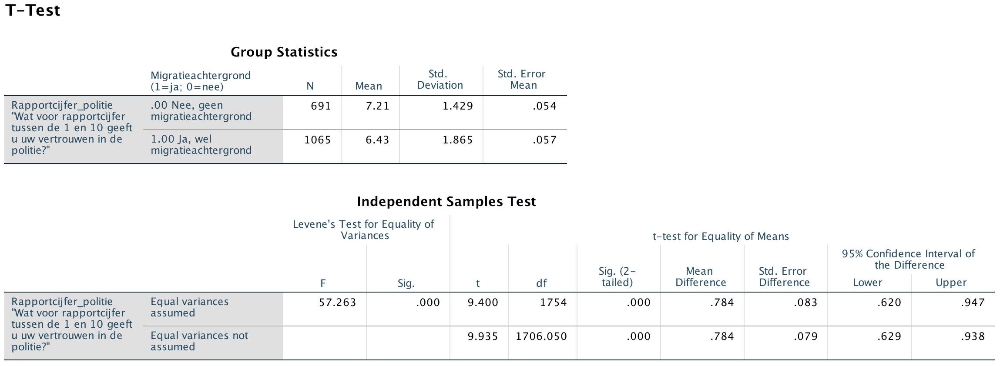

```{r, echo = FALSE, results = "hide"}
include_supplement("Screen__Shot__2020-04-30__at__15.00.40.png", recursive = TRUE)
```

Question
========
The researcher expects that people with an immigrant background have less trust in the police than people without a migration background. She conducts an Independent t-test to find out if this is true. The results are below.  
The researcher tests one-way with α = 0.05 (alpha =5%). What is the conclusion? And from what can you tell? Look in the row at "*Equal Variances Assumed*".  
  


Answerlist
----------
* We **reject** the null hypothesis because the observed T-value is greater than the critical value 1.65.
* We **reject** the null hypothesis, because the observed difference between the two averages ("*Mean Difference*") is greater than the critical value 0.05.
* E can **not** reject the null hypothesis, because the observed TRUE value is greater than the critical value 1.65.
* We can **not** reject the null hypothesis, because the observed difference between the two averages ("*Mean Difference*") is greater than the critical value 0.05.

Solution
========

Language Dutch

Levels of Difficulty Easy

M&T Basics of quantitative research Basics of quantitative research

M&T BIS Default value
Answerlist
----------
* True
* False
* False
* False

Meta-information
================
exname: vufsw-tstatistic-0081-en
extype: schoice
exsolution: 1000
exshuffle: TRUE
exsection: inferential statistics/nhst/test statistic/t statistic
exextra[Type]: conceptual
exextra[Program]: NA
exextra[Language]: English
exextra[Level]: statistical reasoning

