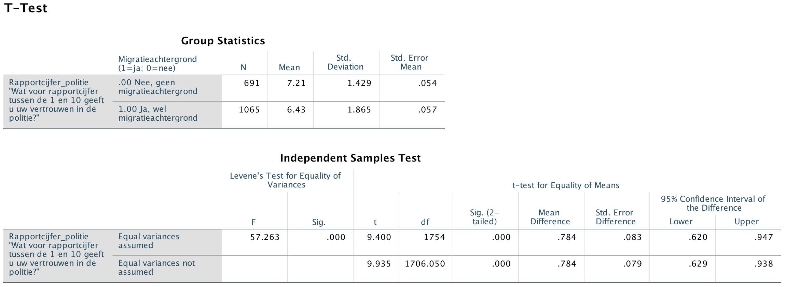

```{r, echo = FALSE, results = "hide"}
include_supplement("Screen__Shot__2020-04-30__at__15.00.40.png")
```

Question
========
De onderzoeker verwacht dat mensen met een migratieachtergrond minder
vertrouwen hebben in de politie dan mensen zonder een
migratieachtergrond. Zij voert een Independent t-test uit om te
achterhalen of dit zo is. De uitkomsten staan hieronder.  
De onderzoeker toetst éénzijdig met α = 0,05 (alpha =5%). Wat is de
conclusie? En waaruit kun je dat opmaken? Kijk in de rij bij “*Equal
Variances Assumed*”.  
  


Answerlist
----------
* We **verwerpen** de nulhypothese, want de geobserveerde T-waarde is
  groter dan de kritieke waarde 1,65.
* We **verwerpen** de nulhypothese, want het geobserveerde verschil tussen
  de twee gemiddelden ("*Mean Difference*") is groter dan de kritieke
  waarde 0,05.
* We kunnen de nulhypothese **niet** verwerpen, want de geobserveerde
  T-waarde is groter dan de kritieke waarde 1,65.
* We kunnen de nulhypothese **niet** verwerpen, want het geobserveerde
  verschil tussen de twee gemiddelden ("*Mean Difference*") is groter dan
  de kritieke waarde 0,05.

Solution
========


Language  
Nederlands

Levels of Difficulty  
Easy

M&T Basics of quantitative research  
Basics of quantitative research

M&T BIS  
Default value
Answerlist
----------
* True
* False
* False
* False

Meta-information
================
exname: vufsw-tstatistic-0081-nl
extype: schoice
exsolution: 1000
exshuffle: TRUE
exsection: inferential statistics/nhst/test statistic/t statistic
exextra[Type]: conceptual
exextra[Program]: NA
exextra[Language]: Dutch
exextra[Level]: statistical reasoning

