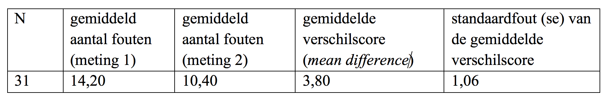

```{r, echo = FALSE, results = "hide"}
include_supplement("Screen__Shot__2019-03-02__at__18.57.08.png", recursive = TRUE)
```

Question
========
English language tests were administered twice to 31 students: the first measurement took place prior to a short language course, the second measurement after they had completed the course. The researcher wanted know whether the number of errors had decreased. He always noted the number of language errors made by the respondents in a test taken. Below are the results.  
The researcher tests whether the number of language errors made after the course is is significantly lower.  
She uses a significance level of 5% (α = .05). What is the conclusion?  
  


Answerlist
----------
* We find empirical evidence for the proposition that the language test had an effect had, because the observed t-value is **greater** than the critical t-value.
* We find empirical evidence for the proposition that the language test had an effect had, because the observed t-value is **smaller** than the critical t-value.
* We find **no** empirical evidence for the proposition that the language test had had an effect, because the observed t-value is **greater** than the critical t-value.
* We find **no** empirical evidence for the proposition that the language test had had an effect, because the observed t-value is **smaller** than the critical t-value.

Solution
========

Answerlist
----------
* True
* False
* False
* False

Meta-information
================
exname: vufsw-tstatistic-0084-en
extype: schoice
exsolution: 1000
exshuffle: TRUE
exsection: inferential statistics/nhst/test statistic/t statistic
exextra[ID]: 0201d
exextra[Type]: performing analysis
exextra[Program]: calculator
exextra[Language]: English
exextra[Level]: statistical literacy

