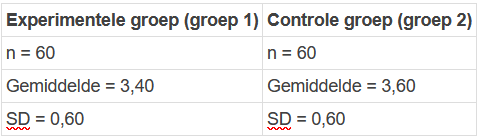

```{r, echo = FALSE, results = "hide"}
include_supplement("1643016030727.png", recursive = TRUE)
```

Question
========
For her master's thesis, a student used an experimental design to investigate whether subjects who had to read an unfavorable news report had to read a less positive assessment regarding a particular company's image than subjects who read a neutral news item read. The rating was measured on a scale from 1 (very negative) to 5 (very positive).  
  
The results show that the average rating of the two groups is as follows (see below)  The one-sided hypothesis of the researcher is that the mean rating of the experimental group is significantly lower than that of the control group. She uses a significance level for this test of 5% (α = .05).  
  
What is the **observed absolute t value**? (rounded to 2 decimals)  


Answerlist
----------
* 1,83
* 3,65
* 2,03
* 0,98
* 2,77
* 3,90

Solution
========

Answerlist
----------
* True
* False
* False
* False
* False
* False

Meta-information
================
exname: vufsw-tstatistic-0111-en
extype: schoice
exsolution: 100000
exshuffle: TRUE
exsection: inferential statistics/nhst/test statistic/t statistic
exextra[ID]: 9e868
exextra[Type]: performing analysis
exextra[Program]: calculator
exextra[Language]: English
exextra[Level]: statistical thinking

