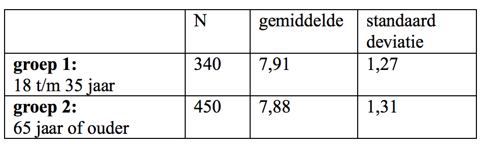

```{r, echo = FALSE, results = "hide"}
include_supplement("Screen__Shot__2021-02-27__at__23.36.42.png", recursive = TRUE)
```

Question
========
A random sample of residents of the Netherlands (source: *European Social Survey*, 2016) was asked the following question asked, "All things considered, how happy would you say you are?", where the response options ranged between "very unhappy" (0) and "very happy (10).  
  
A survey wants to know if there is a significant difference in perceived happiness level between young people (group 1: 18 to 35 years old) and older people (group 2: 65 years or older). The results are in the output below.  
  
Calculate the observed t-value associated with a t-test for two averages (Independent Samples T-test) to test whether there is a difference between the two groups.  
  


Answerlist
----------
* The observed t-value is 0.32.
* The observed t-value is 3.51.
* The observed t-value is 1.65.
* The observed t value is 2.38.

Solution
========

Language Dutch

Levels of Difficulty Easy

M&T Basics of quantitative research Basics of quantitative research

M&T BIS Default value
Answerlist
----------
* True
* False
* False
* False

Meta-information
================
exname: vufsw-tstatistic-0190-en
extype: schoice
exsolution: 1000
exshuffle: TRUE
exsection: inferential statistics/nhst/test statistic/t statistic
exextra[Type]: calculation
exextra[Program]: calculator
exextra[Language]: English
exextra[Level]: statistical thinking

