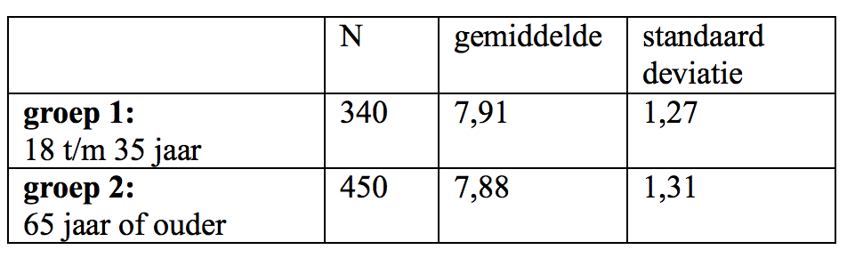

```{r, echo = FALSE, results = "hide"}
include_supplement("Screen__Shot__2021-02-27__at__23.36.42.png")
```

Question
========
Een willekeurige steekproef van inwoners van Nederlanders
(bron: *European Social Survey*, 2016) kreeg de volgende vraag
voorgelegd: “Alles bij elkaar genomen, hoe gelukkig zou u zeggen dat u
bent?”, waarbij de antwoordmogelijkheden lagen tussen “zeer ongelukkig”
(0) en “zeer gelukkig (10).  
  
Een onderzoek wil weten of er een significant verschil is in het ervaren
geluksniveau tussen jongeren (groep 1: 18 t/m 35 jaar) en ouderen (groep
2: 65 jaar of ouder). De uitkomsten staan in de onderstaande output.  
  
Bereken de geobserveerde t-waarde die hoort bij een t-toets voor twee
gemiddelden (Independent Samples T-test) om te toetsen of er een
verschil is tussen beide groepen.  
  


Answerlist
----------
* De geobserveerde t-waarde is 0,32.
* De geobserveerde t-waarde is 3,51.
* De geobserveerde t-waarde is 1,65.
* De geobserveerde t-waarde is 2,38

Solution
========


Language  
Nederlands

Levels of Difficulty  
Easy

M&T Basics of quantitative research  
Basics of quantitative research

M&T BIS  
Default value
Answerlist
----------
* True
* False
* False
* False

Meta-information
================
exname: vufsw-tstatistic-0190-nl
extype: schoice
exsolution: 1000
exshuffle: TRUE
exsection: inferential statistics/nhst/test statistic/t statistic
exextra[Type]: calculation
exextra[Program]: calculator
exextra[Language]: dutch
exextra[Level]: statistical thinking

