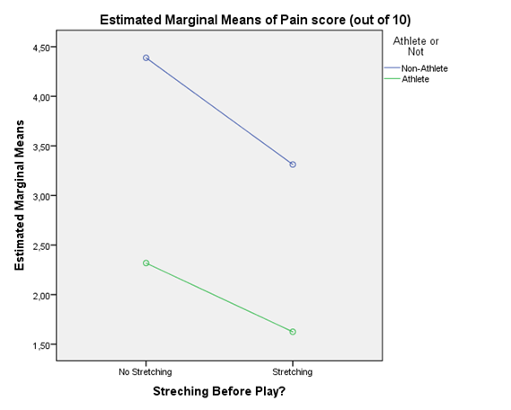

```{r, echo = FALSE, results = "hide"}
include_supplement("1606310848601.png", recursive = TRUE)
include_supplement("1606310861407.png", recursive = TRUE)
include_supplement("1606310896679.png", recursive = TRUE)
include_supplement("1606310920191.png", recursive = TRUE)
```

Question
========
Field claims that there has been an increase in muscle injuries as a as a result of playing Nintendo's Wii computer game. A researcher expects that people who play sports are less affected by this suffer from this because they are already accustomed to exercise. For those non-athletes, she expects that a warm-up prior to a Wii session will help prevent these injuries.  
  
To investigate this, she selects 120 athletes and 120 non-athletes ('athlete' - yes(1)/no(0)). Within each of the two groups, the participants were then randomly assigned to two groups: half had to do a 5-minute stretching (warm-up), and the other half did not (variable 'stretch' - yes(1)/no(0)). In all participants, after after the 4-hour Wii session, pain symptoms were measured on a scale of 1-10 ('injury'; 0 = no pain, 10 = strong pain).  
  
Below are the results of the analysis.  
  
 
  
  
 
  
The F value of 'athlete' is omitted, as is the mean square . How large is the F of 'athlete'? *Fill in only (!) a number in two decimal places, nothing else.  
 *


Solution
========

Meta-information
================
exname: vufsw-twoway anova-1327-en
extype: string
exsolution: 75.75
exsection: inferential statistics/parametric techniques/anova/twoway anova
exextra[Type]: interpreting output
exextra[Program]: calculator
exextra[Language]: English
exextra[Level]: statistical literacy

