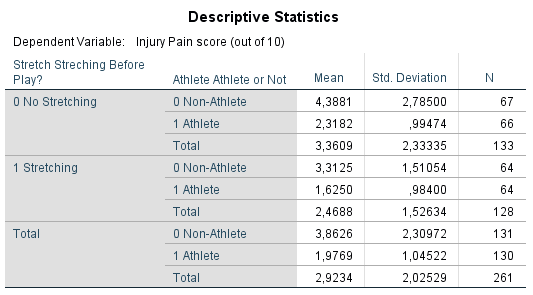
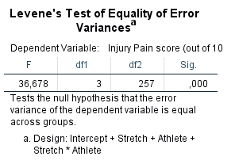
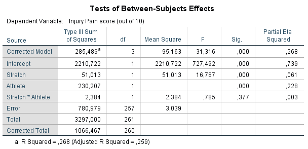
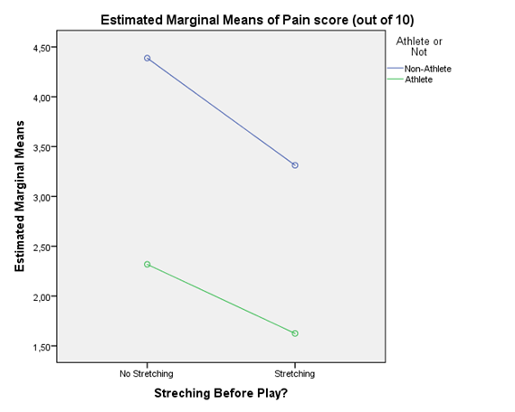

```{r, echo = FALSE, results = "hide"}
include_supplement("1606310848601.png", recursive = TRUE)
include_supplement("1606310861407.png", recursive = TRUE)
include_supplement("1606310896679.png", recursive = TRUE)
include_supplement("1606310920191.png", recursive = TRUE)
```

Question
========
Field claims that there has been an increase in muscle injuries as a as a result of playing Nintendo's Wii computer game. A researcher expects that people who play sports are less affected by this suffer from this because they are already accustomed to exercise. For those non-athletes, she expects that a warm-up prior to a Wii session will help prevent these injuries.  
  
To investigate this, she selects 120 athletes and 120 non-athletes ('athlete' - yes(1)/no(0)). Within each of the two groups, the participants were then randomly assigned to two groups: half had to do a 5-minute stretching (warm-up), and the other half did not (variable 'stretch' - yes(1)/no(0)). In all participants, after after the 4-hour Wii session, pain symptoms were measured on a scale of 1-10 ('injury'; 0 = no pain, 10 = strong pain).  
  
Below are the results of the analysis.  
  
 
  
  
 
  
Which of the *F* values below tests whether there are differences in the mean pain symptoms between the four distinct groups?

Answerlist
----------
* .785
* 31.316
* 36.678
* 727.492

Solution
========

Answerlist
----------
* False
* True
* False
* False

Meta-information
================
exname: vufsw-twoway anova-1328-en
extype: schoice
exsolution: 0100
exshuffle: TRUE
exsection: inferential statistics/parametric techniques/anova/twoway anova
exextra[ID]: 65e80
exextra[Type]: interpreting output
exextra[Program]: NA
exextra[Language]: English
exextra[Level]: statistical literacy

