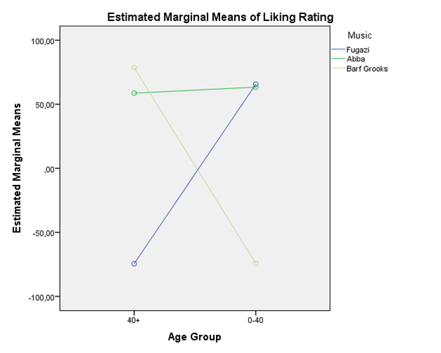

```{r, echo = FALSE, results = "hide"}
include_supplement("1602950529966.png", recursive = TRUE)
include_supplement("1602950556931.png", recursive = TRUE)
include_supplement("1602950597019.png", recursive = TRUE)
include_supplement("1602950627758.png", recursive = TRUE)
include_supplement("1602950646258.png", recursive = TRUE)
```

Question
========
Do your music tastes change as you get older? Field expects so and investigates this by distinguishing in an experiment two age groups young adults under 40 and older adults over 40. (variable: age). Both age groups are also randomly divided into three smaller groups, and these have to listen to music by Fugazo, Abba, or Barf Grooks (variable: music). Each participant rates the music on a scale of -100 to +100 (variable: liking; a higher score means higher "liking").  
 

  
  

  
Which of the F values below tests whether there are differences in the average music appreciation between the (2 age groups x 3 types of music =) six distinct groups?

Answerlist
----------
* 1.961
* 163.330
* 386.227
* 762.502

Solution
========

Answerlist
----------
* False
* False
* True
* False

Meta-information
================
exname: vufsw-twoway anova-1375-en
extype: schoice
exsolution: 0010
exshuffle: TRUE
exsection: inferential statistics/parametric techniques/anova/twoway anova
exextra[Type]: interpreting output
exextra[Program]: NA
exextra[Language]: English
exextra[Level]: statistical literacy

