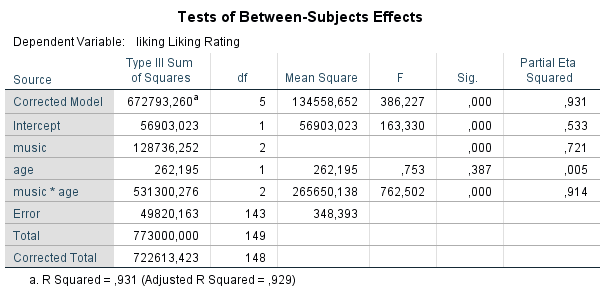

```{r, echo = FALSE, results = "hide"}
include_supplement("1602950529966.png", recursive = TRUE)
include_supplement("1602950556931.png", recursive = TRUE)
include_supplement("1602950597019.png", recursive = TRUE)
include_supplement("1602950627758.png", recursive = TRUE)
include_supplement("1602950646258.png", recursive = TRUE)
```

Question
========
Verandert je muzieksmaak als je ouder wordt? Field verwacht van wel en
onderzoekt dit door in een experiment twee leeftijdsgroepen te
onderscheiden: jong volwassenen onder de 40 en ouderen, boven de 40
(variabele: age). Beide leeftijdsgroepen zijn bovendien random
opgesplitst in drie kleinere groepen, en deze moeten luisteren naar
muziek van Fugazo, Abba, of Barf Grooks (variabele: music). Iedere
deelnemer beoordeelt de muziek op een schaal van -100 tot + 100
(variabele: liking,  een hogere score betekent een hogere ‘liking’).  
 

  
  

  
Welke uitspraak kunnen we op grond van de uitkomsten doen over de
populatie?  
1: De verwachting van Field klopte: de muzieksmaak verschilt tussen de
leeftijdsgroepen  
2: Welke van de drie muzieksmaken het meest gewaardeerd wordt en welke
het minst, is voor jongere leeftijdsgroep anders dan voor oudere
leeftijdsgroep

Answerlist
----------
* Alleen uitspraak 1
* Alleen uitspraak 2
* Beide uitspraken
* Geen van beide uitspraken

Solution
========


Answerlist
----------
* False
* False
* True
* False

Meta-information
================
exname: vufsw-twoway anova-1376-nl
extype: schoice
exsolution: 0010
exshuffle: TRUE
exsection: inferential statistics/parametric techniques/anova/twoway anova
exextra[ID]: d635e
exextra[Type]: interpreting output
exextra[Program]: NA
exextra[Language]: Dutch
exextra[Level]: statistical reasoning

