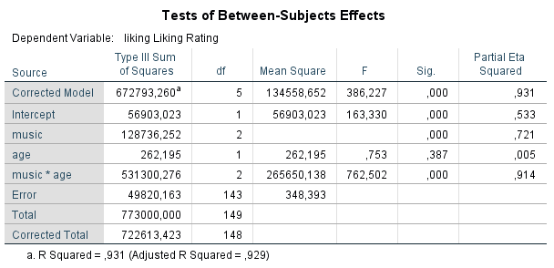
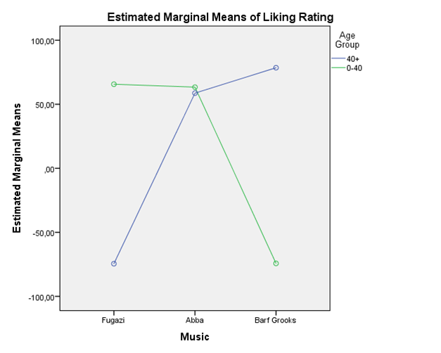

```{r, echo = FALSE, results = "hide"}
include_supplement("vufsw-twoway_anova-1378-1-en.png", recursive = TRUE)
include_supplement("vufsw-twoway_anova-1378-2-en.png", recursive = TRUE)
include_supplement("vufsw-twoway_anova-1378-3-en.png", recursive = TRUE)
include_supplement("vufsw-twoway_anova-1378-4-en.png", recursive = TRUE)
include_supplement("vufsw-twoway_anova-1378-5-en.png", recursive = TRUE)
```

Question
========
Do your music tastes change as you get older? Field expects so and investigates this by distinguishing in an experiment two age groups young adults under 40 and older adults over 40. (variable: age). Both age groups are also randomly divided into three smaller groups, and these have to listen to music by Fugazo, Abba, or Barf Grooks (variable: music). Each participant rates the music on a scale of -100 to +100 (variable: liking; a higher score means higher "liking").  
 

  
  

  
Can you draw conclusions about the causal relationship between age and the type of music valued?

Answerlist
----------
* Yes, respondents were randomly assigned to age groups
* Yes, although age is not an experimentally manipulated variable, but is not likely to be confounding variables for the relationship between age and ratings for the three types of music
* No, this study did not control for possible confounding variables for the relationship between age and appreciation for the three types of music
* No, this study did not control for possible mediating variables for the relationship between age and appreciation for the three types of music

Solution
========

Answerlist
----------
* False
* True
* False
* False

Meta-information
================
exname: vufsw-twoway anova-1378-en
extype: schoice
exsolution: 0100
exshuffle: TRUE
exsection: inferential statistics/parametric techniques/anova/twoway anova
exextra[Type]: interpreting output
exextra[Program]: NA
exextra[Language]: English
exextra[Level]: statistical reasoning

