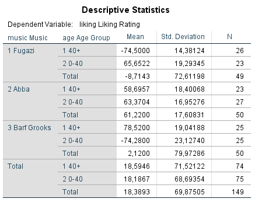

```{r, echo = FALSE, results = "hide"}
include_supplement("vufsw-twoway_anova-1378-1-nl.png", recursive = TRUE)
include_supplement("vufsw-twoway_anova-1378-2-nl.png", recursive = TRUE)
include_supplement("vufsw-twoway_anova-1378-3-nl.png", recursive = TRUE)
include_supplement("vufsw-twoway_anova-1378-4-nl.png", recursive = TRUE)
include_supplement("vufsw-twoway_anova-1378-5-nl.png", recursive = TRUE)
```

Question
========
Verandert je muzieksmaak als je ouder wordt? Field verwacht van wel en
onderzoekt dit door in een experiment twee leeftijdsgroepen te
onderscheiden: jong volwassenen onder de 40 en ouderen, boven de 40
(variabele: age). Beide leeftijdsgroepen zijn bovendien random
opgesplitst in drie kleinere groepen, en deze moeten luisteren naar
muziek van Fugazo, Abba, of Barf Grooks (variabele: music). Iedere
deelnemer beoordeelt de muziek op een schaal van -100 tot + 100
(variabele: liking,  een hogere score betekent een hogere ‘liking’).  
 

  
  

  
Kun je op basis van dit onderzoek conclusies trekken over de causale
relatie tussen leeftijd en het soort muziek dat gewaardeerd wordt?

Answerlist
----------
* Ja, de respondenten zijn willekeurig ingedeeld in leeftijdsgroepen
* Ja, leeftijd is weliswaar geen experimenteel gemanipuleerde variabele,
  maar is het niet aannemelijk dat er confounding variabelen zijn voor de
  relatie tussen leeftijd en de waardering voor de drie soorten muziek
* Nee, er is in dit onderzoek niet gecontroleerd voor mogelijke
  confounding variabelen voor de relatie tussen leeftijd en de waardering
  voor de drie soorten muziek
* Nee, er is in dit onderzoek niet gecontroleerd voor mogelijke mediërende
  variabelen voor de relatie tussen leeftijd en de waardering voor de drie
  soorten muziek

Solution
========


Answerlist
----------
* False
* True
* False
* False

Meta-information
================
exname: vufsw-twoway anova-1378-nl
extype: schoice
exsolution: 0100
exshuffle: TRUE
exsection: inferential statistics/parametric techniques/anova/twoway anova
exextra[Type]: interpreting output
exextra[Program]: NA
exextra[Language]: Dutch
exextra[Level]: statistical reasoning

