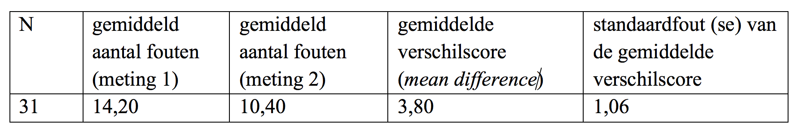

```{r, echo = FALSE, results = "hide"}
include_supplement("vufsw-typeierror-0195-nl.png", recursive = TRUE)
```

Question
========
Aan 31 studenten werd twee keer een Engelse taaltoets voorgelegd: de
eerste meting vond plaats voorafgaande aan een korte taalcursus, de
tweede meting nadat zij de cursus hadden afgerond. De onderzoeker wilde
weten of het aantal fouten was afgenomen. Zij noteerde steeds het aantal
gemaakte taalfouten van de respondenten in een afgenomen test. Hieronder
staan de resultaten.  
De onderzoeker toetst de hypothese dat het aantal gemaakte taalfouten na
de cursus significant lager is dan voor de cursus.  
  
Stel, de onderzoeker maakt de zogenoemde **Type I fout.** Welke fout
wordt dan gemaakt?  
  


Answerlist
----------
* De cursus heeft in werkelijkheid (in de populatie) **geen** positief
  effect, maar uit het onderzoek blijkt dat de geobserveerde afname van
  het gemiddelde aantal fouten tussen de voor- en nameting (meting 1 en 2)
  **wel** significant is.
* De cursus heeft in werkelijkheid (in de populatie) een** **positief
  effect, maar uit het onderzoek blijkt dat de geobserveerde afname van
  het gemiddelde aantal fouten tussen de voor- en nameting (meting 1 en 2)
  **niet** significant is.
* De cursus heeft in werkelijkheid (in de populatie) een** **positief
  effect, maar uit het onderzoek blijkt dat de geobserveerde afname van
  het gemiddelde aantal fouten tussen de voor- en nameting (meting 1 en 2)
  **wel** significant is.
* De cursus heeft in werkelijkheid (in de populatie) **geen **positief
  effect, maar uit het onderzoek blijkt dat de geobserveerde afname van
  het gemiddelde aantal fouten tussen de voor- en nameting (meting 1 en 2)
  **niet** significant is.

Solution
========


Language  
Nederlands

Levels of Difficulty  
Easy

M&T Basics of quantitative research  
Basics of quantitative research

M&T BIS  
Default value
Answerlist
----------
* True
* False
* False
* False

Meta-information
================
exname: vufsw-typeierror-0195-nl
extype: schoice
exsolution: 1000
exshuffle: TRUE
exsection: inferential statistics/nhst/statistical errors/type I error
exextra[Type]: conceptual
exextra[Program]: NA
exextra[Language]: Dutch
exextra[Level]: statistical literacy

