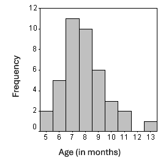

```{r, echo = FALSE, results = "hide"}
include_supplement("uva-interval-333-en-graph01.PNG", recursive = TRUE)
```

Question
========

The adjacent chart shows the age (in months) of 40 babies at which their first tooth broke through. The variable age is



Answerlist
----------

* Quantitative, on interval scale
* Qualitative, on ordinal scale
* Quantitative, on ratios scale
* Qualitative, on interval scale

Solution
========

Answerlist
----------

* Quantitative, on interval scale: Incorrect
* Qualitative, on ordinal scale: Incorrect
* Quantitative, on ratioscale: Correct
* Qualitative, on interval scale: Incorrect

Meta-information
================
exname: uva-interval-333-en
extype: schoice
exsolution: 0010
exsection: Measurement Level/Interval
exextra[Type]: Conceptual
exextra[Language]: English
exextra[Level]: Statistical Literacy
exextra[IRT-Difficulty]: 4.473
exextra[p-value]: 0.0206
